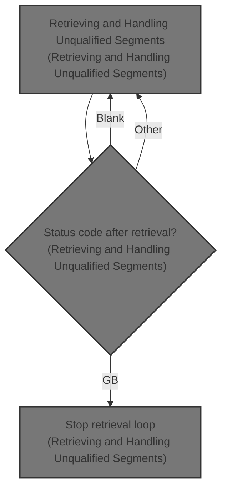

# Overview

This document describes the process of retrieving and handling unqualified segments from a database. The flow fetches segment data, displays it when successful, and stops or handles errors based on the status code returned after each retrieval.

## Dependencies

### Programs

- PART0005 (<SwmPath>[src/part0005.cob](src/part0005.cob)</SwmPath>)
- CBLTDLI
- ABENDPMG

### Copybooks

- PARTSG01 (<SwmPath>[src/partsg01.cpy](src/partsg01.cpy)</SwmPath>)
- PRICSG05 (<SwmPath>[src/pricsg05.cpy](src/pricsg05.cpy)</SwmPath>)
- ADDLSG07 (<SwmPath>[src/addlsg07.cpy](src/addlsg07.cpy)</SwmPath>)
- STCKSG10 (<SwmPath>[src/stcksg10.cpy](src/stcksg10.cpy)</SwmPath>)
- ORDSEG15 (<SwmPath>[src/ordseg15.cpy](src/ordseg15.cpy)</SwmPath>)

&nbsp;

*This is an auto-generated document by Swimm 🌊 and has not yet been verified by a human*

<SwmMeta version="3.0.0" repo-id="Z2l0aHViJTNBJTNBaW1zZGJkYyUzQSUzQUdpcmktU3dpbW0=" repo-name="imsdbdc">Powered by [Swimm](https://app.swimm.io/)</SwmMeta>
