# Overview

This document explains the flow of retrieving database segments. The process repeatedly fetches segment information, displays it to the user, and handles errors until a completion status is reached.

## Dependencies

### Programs

- <SwmToken path="src/part0005.cob" pos="2:7:7" line-data="000200 PROGRAM-ID. PART0005.                                            00020034">`PART0005`</SwmToken> (<SwmPath>[src/part0005.cob](src/part0005.cob)</SwmPath>)
- CBLTDLI
- ABENDPMG

### Copybooks

- <SwmToken path="src/part0005.cob" pos="130:10:10" line-data="011900       DISPLAY SEG-NAME &#39; PARTSG01 IO &#39;  PRICSG05-IO              00530030">`PARTSG01`</SwmToken> (<SwmPath>[src/partsg01.cpy](src/partsg01.cpy)</SwmPath>)
- <SwmToken path="src/part0005.cob" pos="123:4:4" line-data="011200     INITIALIZE PRICSG05-IO                                       00440030">`PRICSG05`</SwmToken> (<SwmPath>[src/pricsg05.cpy](src/pricsg05.cpy)</SwmPath>)
- <SwmToken path="src/part0005.cob" pos="21:4:4" line-data="001000 COPY ADDLSG07.                                                   00083010">`ADDLSG07`</SwmToken> (<SwmPath>[src/addlsg07.cpy](src/addlsg07.cpy)</SwmPath>)
- <SwmToken path="src/part0005.cob" pos="22:4:4" line-data="001100 COPY STCKSG10.                                                   00084010">`STCKSG10`</SwmToken> (<SwmPath>[src/stcksg10.cpy](src/stcksg10.cpy)</SwmPath>)
- <SwmToken path="src/part0005.cob" pos="23:4:4" line-data="001200 COPY ORDSEG15.                                                   00085010">`ORDSEG15`</SwmToken> (<SwmPath>[src/ordseg15.cpy](src/ordseg15.cpy)</SwmPath>)

# Workflow

# Looping to Retrieve Database Segments

```mermaid
%%{init: {"flowchart": {"defaultRenderer": "elk"}} }%%
flowchart TD
    node1["Display 'PARTGNP1 STARTED'"]
    click node1 openCode "src/part0005.cob:92:92"
    node1 --> node2["Begin segment retrieval loop"]
    click node2 openCode "src/part0005.cob:96:97"
    
    subgraph loop1["Repeat until STATUS-CODE is 'GB'"]
        node2 --> node3["Retrieve segment data"]
        click node3 openCode "src/part0005.cob:123:127"
        node3 --> node4{"Is STATUS-CODE 'GB'?"}
        click node4 openCode "src/part0005.cob:129:132"
        node4 -->|"No"| node5["Display SEG-NAME and segment info"]
        click node5 openCode "src/part0005.cob:130:130"
        node5 --> node2
        node4 -->|"Yes"| node6["Exit loop"]
        click node6 openCode "src/part0005.cob:133:138"
    end
    node6 --> node7["GOBACK (End process)"]
    click node7 openCode "src/part0005.cob:99:99"

classDef HeadingStyle fill:#777777,stroke:#333,stroke-width:2px;

%% Swimm:
%% %%{init: {"flowchart": {"defaultRenderer": "elk"}} }%%
%% flowchart TD
%%     node1["Display '<SwmToken path="src/part0005.cob" pos="92:5:5" line-data="008100     DISPLAY &#39;PARTGNP1 STARTED&#39;.                                  00270010">`PARTGNP1`</SwmToken> STARTED'"]
%%     click node1 openCode "<SwmPath>[src/part0005.cob](src/part0005.cob)</SwmPath>:92:92"
%%     node1 --> node2["Begin segment retrieval loop"]
%%     click node2 openCode "<SwmPath>[src/part0005.cob](src/part0005.cob)</SwmPath>:96:97"
%%     
%%     subgraph loop1["Repeat until <SwmToken path="src/part0005.cob" pos="95:3:5" line-data="008400*                        STATUS-CODE = &#39;GB&#39;.                      00300037">`STATUS-CODE`</SwmToken> is 'GB'"]
%%         node2 --> node3["Retrieve segment data"]
%%         click node3 openCode "<SwmPath>[src/part0005.cob](src/part0005.cob)</SwmPath>:123:127"
%%         node3 --> node4{"Is <SwmToken path="src/part0005.cob" pos="95:3:5" line-data="008400*                        STATUS-CODE = &#39;GB&#39;.                      00300037">`STATUS-CODE`</SwmToken> 'GB'?"}
%%         click node4 openCode "<SwmPath>[src/part0005.cob](src/part0005.cob)</SwmPath>:129:132"
%%         node4 -->|"No"| node5["Display <SwmToken path="src/part0005.cob" pos="130:4:6" line-data="011900       DISPLAY SEG-NAME &#39; PARTSG01 IO &#39;  PRICSG05-IO              00530030">`SEG-NAME`</SwmToken> and segment info"]
%%         click node5 openCode "<SwmPath>[src/part0005.cob](src/part0005.cob)</SwmPath>:130:130"
%%         node5 --> node2
%%         node4 -->|"Yes"| node6["Exit loop"]
%%         click node6 openCode "<SwmPath>[src/part0005.cob](src/part0005.cob)</SwmPath>:133:138"
%%     end
%%     node6 --> node7["GOBACK (End process)"]
%%     click node7 openCode "<SwmPath>[src/part0005.cob](src/part0005.cob)</SwmPath>:99:99"
%% 
%% classDef HeadingStyle fill:#777777,stroke:#333,stroke-width:2px;
```



This section manages the retrieval of database segments in a loop, displaying segment information and handling errors until a completion status is reached.

| Rule ID | Category        | Rule Name                        | Description                                                                                                                                                                                                                                                                                   | Implementation Details                                                                                                                                                                                                                                                                                                                                                                                                                                                                                                                                                                                                                            |
| ------- | --------------- | -------------------------------- | --------------------------------------------------------------------------------------------------------------------------------------------------------------------------------------------------------------------------------------------------------------------------------------------- | ------------------------------------------------------------------------------------------------------------------------------------------------------------------------------------------------------------------------------------------------------------------------------------------------------------------------------------------------------------------------------------------------------------------------------------------------------------------------------------------------------------------------------------------------------------------------------------------------------------------------------------------------- |
| BR-001  | Decision Making | Segment retrieval loop           | Continue retrieving segments until the <SwmToken path="src/part0005.cob" pos="95:3:5" line-data="008400*                        STATUS-CODE = &#39;GB&#39;.                      00300037">`STATUS-CODE`</SwmToken> field in the PCB mask equals 'GB', which signals completion.              | The loop terminates when <SwmToken path="src/part0005.cob" pos="95:3:5" line-data="008400*                        STATUS-CODE = &#39;GB&#39;.                      00300037">`STATUS-CODE`</SwmToken> equals 'GB'. 'GB' is a constant indicating completion.                                                                                                                                                                                                                                                                                                                                                                                      |
| BR-002  | Writing Output  | Successful segment display       | Display segment name and segment information when segment retrieval is successful, indicated by <SwmToken path="src/part0005.cob" pos="95:3:5" line-data="008400*                        STATUS-CODE = &#39;GB&#39;.                      00300037">`STATUS-CODE`</SwmToken> being spaces.    | Segment information is displayed as: <SwmToken path="src/part0005.cob" pos="130:4:6" line-data="011900       DISPLAY SEG-NAME &#39; PARTSG01 IO &#39;  PRICSG05-IO              00530030">`SEG-NAME`</SwmToken> (string, 8 bytes), literal ' <SwmToken path="src/part0005.cob" pos="130:10:10" line-data="011900       DISPLAY SEG-NAME &#39; PARTSG01 IO &#39;  PRICSG05-IO              00530030">`PARTSG01`</SwmToken> IO ', and segment data (format as per <SwmToken path="src/part0005.cob" pos="123:4:6" line-data="011200     INITIALIZE PRICSG05-IO                                       00440030">`PRICSG05-IO`</SwmToken> structure). |
| BR-003  | Writing Output  | Segment retrieval error handling | If segment retrieval fails and <SwmToken path="src/part0005.cob" pos="95:3:5" line-data="008400*                        STATUS-CODE = &#39;GB&#39;.                      00300037">`STATUS-CODE`</SwmToken> is not 'GB' or spaces, display PCB mask information and invoke the abend program. | PCB mask information is displayed as: literal 'PCB MASK IS ', PCB mask (string, 32 bytes as per structure). The abend program is invoked for error handling.                                                                                                                                                                                                                                                                                                                                                                                                                                                                                      |

<SwmSnippet path="/src/part0005.cob" line="91">

---

<SwmToken path="src/part0005.cob" pos="91:2:6" line-data="008000 000-MAIN-PARA.                                                   00260000">`000-MAIN-PARA`</SwmToken> starts the process, then loops, calling <SwmToken path="src/part0005.cob" pos="96:4:10" line-data="008500     PERFORM 200-CALL-GN-UNQSSA THRU 200-EXIT UNTIL               00301037">`200-CALL-GN-UNQSSA`</SwmToken> to fetch segments until 'GB' signals completion.

```cobol
008000 000-MAIN-PARA.                                                   00260000
008100     DISPLAY 'PARTGNP1 STARTED'.                                  00270010
008200                                                                  00280000
008300*    PERFORM 100-CALL-GN-NOSSA  THRU 100-EXIT UNTIL               00290037
008400*                        STATUS-CODE = 'GB'.                      00300037
008500     PERFORM 200-CALL-GN-UNQSSA THRU 200-EXIT UNTIL               00301037
008600                         STATUS-CODE = 'GB'.                      00302037
008700                                                                  00310000
008800     GOBACK.                                                      00320000
```

---

</SwmSnippet>

<SwmSnippet path="/src/part0005.cob" line="122">

---

<SwmToken path="src/part0005.cob" pos="122:2:8" line-data="011100 200-CALL-GN-UNQSSA.                                              00430029">`200-CALL-GN-UNQSSA`</SwmToken> calls 'CBLTDLI' to fetch a segment, displays info if successful, and calls the abend program if there's an error.

```cobol
011100 200-CALL-GN-UNQSSA.                                              00430029
011200     INITIALIZE PRICSG05-IO                                       00440030
011300     CALL 'CBLTDLI'  USING DLI-GN,                                00450029
011400                           PCB-MASK-1,                            00460029
011500                           PRICSG05-IO,                           00471030
011600                           UNQUAL-SSA-05.                         00472030
011700                                                                  00480029
011800     IF STATUS-CODE = '  '                                        00490029
011900       DISPLAY SEG-NAME ' PARTSG01 IO '  PRICSG05-IO              00530030
012000     ELSE                                                         00540029
012100     IF STATUS-CODE = 'GB'                                        00550029
012200       CONTINUE                                                   00560029
012300     ELSE                                                         00570029
012400       DISPLAY 'PCB MASK IS '  PCB-MASK-1                         00580029
012500       CALL WS-ABENDPGM                                           00590029
012600     END-IF                                                       00600029
012700     END-IF.                                                      00610029
```

---

</SwmSnippet>

&nbsp;

*This is an auto-generated document by Swimm 🌊 and has not yet been verified by a human*

<SwmMeta version="3.0.0" repo-id="Z2l0aHViJTNBJTNBaW1zZGJkYyUzQSUzQUdpcmktU3dpbW0=" repo-name="imsdbdc"><sup>Powered by [Swimm](https://app.swimm.io/)</sup></SwmMeta>
