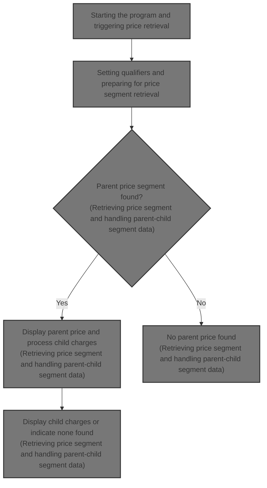

# Overview

This document describes the process of retrieving and displaying price segment data for a parent part and its associated child charges. The flow begins with program initiation, prepares qualifiers, accesses the IMS database, and displays the retrieved data or appropriate messages.



## Dependencies

### Programs

- <SwmToken path="src/part0009.cob" pos="93:5:5" line-data="008600     DISPLAY &#39;PART0009 STARTED&#39;.                                  00270047">`PART0009`</SwmToken> (<SwmPath>[src/part0009.cob](src/part0009.cob)</SwmPath>)
- CBLTDLI
- ABENDPMG

### Copybooks

- <SwmToken path="src/part0009.cob" pos="98:19:19" line-data="009100*    MOVE &#39;PN00A&#39;  TO   FIELD-VALUE-01 OF PARTSG01-QUAL-SSA       00630152">`PARTSG01`</SwmToken> (<SwmPath>[src/partsg01.cpy](src/partsg01.cpy)</SwmPath>)
- <SwmToken path="src/part0009.cob" pos="100:18:18" line-data="009300     MOVE &#39;PRA2&#39;   TO   FIELD-VALUE-05 OF PRICSG05-QUAL-SSA.      00631152">`PRICSG05`</SwmToken> (<SwmPath>[src/pricsg05.cpy](src/pricsg05.cpy)</SwmPath>)
- <SwmToken path="src/part0009.cob" pos="162:4:4" line-data="015500     INITIALIZE ADDLSG07-IO                                       00903045">`ADDLSG07`</SwmToken> (<SwmPath>[src/addlsg07.cpy](src/addlsg07.cpy)</SwmPath>)
- <SwmToken path="src/part0009.cob" pos="22:4:4" line-data="001500 COPY STCKSG10.                                                   00084010">`STCKSG10`</SwmToken> (<SwmPath>[src/stcksg10.cpy](src/stcksg10.cpy)</SwmPath>)
- <SwmToken path="src/part0009.cob" pos="23:4:4" line-data="001600 COPY ORDSEG15.                                                   00085010">`ORDSEG15`</SwmToken> (<SwmPath>[src/ordseg15.cpy](src/ordseg15.cpy)</SwmPath>)

# Workflow

# Starting the program and triggering price retrieval

This section initiates the program, signals its start, triggers price retrieval, and completes execution.

| Rule ID | Category                        | Rule Name               | Description                                                                                            | Implementation Details                                                                                                                                                                                                                                                             |
| ------- | ------------------------------- | ----------------------- | ------------------------------------------------------------------------------------------------------ | ---------------------------------------------------------------------------------------------------------------------------------------------------------------------------------------------------------------------------------------------------------------------------------- |
| BR-001  | Writing Output                  | Start message display   | When the program starts, a start message is displayed to inform the user that execution has begun.     | The message displayed is '<SwmToken path="src/part0009.cob" pos="93:5:5" line-data="008600     DISPLAY &#39;PART0009 STARTED&#39;.                                  00270047">`PART0009`</SwmToken> STARTED'. The output is a string, left-aligned, without additional formatting. |
| BR-002  | Invoking a Service or a Process | Price retrieval trigger | The program triggers retrieval of parent segment price data by invoking the price retrieval process.   | The retrieval process is invoked by calling a paragraph responsible for fetching price data from IMS using access criteria. No input parameters are passed in this section.                                                                                                        |
| BR-003  | Technical Step                  | Program completion      | After price retrieval is triggered, the program completes execution and returns control to the caller. | Execution ends with a return to the caller. No output is produced at this step.                                                                                                                                                                                                    |

<SwmSnippet path="/src/part0009.cob" line="92">

---

<SwmToken path="src/part0009.cob" pos="92:2:6" line-data="008500 000-MAIN-PARA.                                                   00260000">`000-MAIN-PARA`</SwmToken> kicks off the flow by displaying a start message, then calls <SwmToken path="src/part0009.cob" pos="94:4:10" line-data="008700     PERFORM 100-CALL-GU-QSSA   THRU 100-EXIT.                    00302038">`100-CALL-GU-QSSA`</SwmToken> to fetch parent segment price data from IMS using access criteria. The GOBACK at the end returns control to the caller, marking the end of execution.

```cobol
008500 000-MAIN-PARA.                                                   00260000
008600     DISPLAY 'PART0009 STARTED'.                                  00270047
008700     PERFORM 100-CALL-GU-QSSA   THRU 100-EXIT.                    00302038
008800     GOBACK.                                                      00320000
```

---

</SwmSnippet>

# Setting qualifiers and preparing for price segment retrieval

This section prepares qualifier codes and initiates the retrieval of price segment data from the IMS database. It ensures that the correct qualifiers are set before triggering the price retrieval process.

| Rule ID | Category                        | Rule Name                                                                                                                                                                            | Description                                                                                                                                                                                                                                                           | Implementation Details                                                                                                                                                                                                                                                                                   |
| ------- | ------------------------------- | ------------------------------------------------------------------------------------------------------------------------------------------------------------------------------------ | --------------------------------------------------------------------------------------------------------------------------------------------------------------------------------------------------------------------------------------------------------------------- | -------------------------------------------------------------------------------------------------------------------------------------------------------------------------------------------------------------------------------------------------------------------------------------------------------- |
| BR-001  | Calculation                     | Set <SwmToken path="src/part0009.cob" pos="100:5:5" line-data="009300     MOVE &#39;PRA2&#39;   TO   FIELD-VALUE-05 OF PRICSG05-QUAL-SSA.      00631152">`PRA2`</SwmToken> Qualifier | Set the qualifier code <SwmToken path="src/part0009.cob" pos="100:5:5" line-data="009300     MOVE &#39;PRA2&#39;   TO   FIELD-VALUE-05 OF PRICSG05-QUAL-SSA.      00631152">`PRA2`</SwmToken> in the designated qualifier field before retrieving price segment data. | The value <SwmToken path="src/part0009.cob" pos="100:5:5" line-data="009300     MOVE &#39;PRA2&#39;   TO   FIELD-VALUE-05 OF PRICSG05-QUAL-SSA.      00631152">`PRA2`</SwmToken> is a constant string assigned to the qualifier field. No additional formatting or padding is specified in this section. |
| BR-002  | Invoking a Service or a Process | Trigger Price Segment Retrieval                                                                                                                                                      | Trigger the retrieval of price segment data from the IMS database after qualifiers are set.                                                                                                                                                                           | The retrieval process is initiated by invoking a designated process that accesses the IMS database. The output includes price data and a status code, as described in the call information.                                                                                                              |

<SwmSnippet path="/src/part0009.cob" line="97">

---

In <SwmToken path="src/part0009.cob" pos="97:2:8" line-data="009000 100-CALL-GU-QSSA.                                                00630038">`100-CALL-GU-QSSA`</SwmToken>, we set up qualifier codes in the relevant data structures, then call <SwmToken path="src/part0009.cob" pos="101:4:14" line-data="009400     PERFORM 120-GU-PART-PRICE-GNP-CHARGE THRU 120-EXIT.          00632052">`120-GU-PART-PRICE-GNP-CHARGE`</SwmToken> to actually retrieve the price segment data from IMS. The commented lines show alternate flows or setups, but the main action here is prepping the qualifiers and triggering the price retrieval.

```cobol
009000 100-CALL-GU-QSSA.                                                00630038
009100*    MOVE 'PN00A'  TO   FIELD-VALUE-01 OF PARTSG01-QUAL-SSA       00630152
009200*    PERFORM 110-GU-PART-GNP-PRICE THRU 110-EXIT.                 00631052
009300     MOVE 'PRA2'   TO   FIELD-VALUE-05 OF PRICSG05-QUAL-SSA.      00631152
009400     PERFORM 120-GU-PART-PRICE-GNP-CHARGE THRU 120-EXIT.          00632052
```

---

</SwmSnippet>

## Retrieving price segment and handling parent-child segment data

```mermaid
%%{init: {"flowchart": {"defaultRenderer": "elk"}} }%%
flowchart TD
    node1["Retrieve parent part price"] --> node2{"STATUS-CODE = '  '?"}
    click node1 openCode "src/part0009.cob:140:146"
    node2 -->|"Yes"| node3["Display parent price"]
    click node2 openCode "src/part0009.cob:148:148"
    node2 -->|"No"| node4{"STATUS-CODE = 'GE'?"}
    click node4 openCode "src/part0009.cob:153:153"
    node4 -->|"Yes"| node7["Finish - No parent price found"]
    click node7 openCode "src/part0009.cob:154:154"
    node4 -->|"No"| node6["Display PCB-MASK-1 and abort"]
    click node6 openCode "src/part0009.cob:156:157"
    node3 --> node5["Process child charges"]
    click node3 openCode "src/part0009.cob:149:149"
    
    subgraph loop1["For each child charge until end"]
        node5 --> node8["Retrieve child charge"]
        click node8 openCode "src/part0009.cob:162:166"
        node8 --> node9{"STATUS-CODE = '  '?"}
        click node9 openCode "src/part0009.cob:168:168"
        node9 -->|"Yes"| node10["Display child charge"]
        click node10 openCode "src/part0009.cob:169:169"
        node10 --> node8
        node9 -->|"No"| node11{"STATUS-CODE = 'GE'?"}
        click node11 openCode "src/part0009.cob:171:171"
        node11 -->|"Yes"| node12["Finish child charges"]
        click node12 openCode "src/part0009.cob:172:172"
        node11 -->|"No"| node13["Display PCB-MASK-1 and abort"]
        click node13 openCode "src/part0009.cob:174:175"
    end
    node5 --> node12
classDef HeadingStyle fill:#777777,stroke:#333,stroke-width:2px;

%% Swimm:
%% %%{init: {"flowchart": {"defaultRenderer": "elk"}} }%%
%% flowchart TD
%%     node1["Retrieve parent part price"] --> node2{"<SwmToken path="src/part0009.cob" pos="148:4:6" line-data="014100     IF STATUS-CODE = &#39;  &#39;                                        00840036">`STATUS-CODE`</SwmToken> = '  '?"}
%%     click node1 openCode "<SwmPath>[src/part0009.cob](src/part0009.cob)</SwmPath>:140:146"
%%     node2 -->|"Yes"| node3["Display parent price"]
%%     click node2 openCode "<SwmPath>[src/part0009.cob](src/part0009.cob)</SwmPath>:148:148"
%%     node2 -->|"No"| node4{"<SwmToken path="src/part0009.cob" pos="148:4:6" line-data="014100     IF STATUS-CODE = &#39;  &#39;                                        00840036">`STATUS-CODE`</SwmToken> = 'GE'?"}
%%     click node4 openCode "<SwmPath>[src/part0009.cob](src/part0009.cob)</SwmPath>:153:153"
%%     node4 -->|"Yes"| node7["Finish - No parent price found"]
%%     click node7 openCode "<SwmPath>[src/part0009.cob](src/part0009.cob)</SwmPath>:154:154"
%%     node4 -->|"No"| node6["Display <SwmToken path="src/part0009.cob" pos="143:2:6" line-data="013600                           PCB-MASK-1,                            00800036">`PCB-MASK-1`</SwmToken> and abort"]
%%     click node6 openCode "<SwmPath>[src/part0009.cob](src/part0009.cob)</SwmPath>:156:157"
%%     node3 --> node5["Process child charges"]
%%     click node3 openCode "<SwmPath>[src/part0009.cob](src/part0009.cob)</SwmPath>:149:149"
%%     
%%     subgraph loop1["For each child charge until end"]
%%         node5 --> node8["Retrieve child charge"]
%%         click node8 openCode "<SwmPath>[src/part0009.cob](src/part0009.cob)</SwmPath>:162:166"
%%         node8 --> node9{"<SwmToken path="src/part0009.cob" pos="148:4:6" line-data="014100     IF STATUS-CODE = &#39;  &#39;                                        00840036">`STATUS-CODE`</SwmToken> = '  '?"}
%%         click node9 openCode "<SwmPath>[src/part0009.cob](src/part0009.cob)</SwmPath>:168:168"
%%         node9 -->|"Yes"| node10["Display child charge"]
%%         click node10 openCode "<SwmPath>[src/part0009.cob](src/part0009.cob)</SwmPath>:169:169"
%%         node10 --> node8
%%         node9 -->|"No"| node11{"<SwmToken path="src/part0009.cob" pos="148:4:6" line-data="014100     IF STATUS-CODE = &#39;  &#39;                                        00840036">`STATUS-CODE`</SwmToken> = 'GE'?"}
%%         click node11 openCode "<SwmPath>[src/part0009.cob](src/part0009.cob)</SwmPath>:171:171"
%%         node11 -->|"Yes"| node12["Finish child charges"]
%%         click node12 openCode "<SwmPath>[src/part0009.cob](src/part0009.cob)</SwmPath>:172:172"
%%         node11 -->|"No"| node13["Display <SwmToken path="src/part0009.cob" pos="143:2:6" line-data="013600                           PCB-MASK-1,                            00800036">`PCB-MASK-1`</SwmToken> and abort"]
%%         click node13 openCode "<SwmPath>[src/part0009.cob](src/part0009.cob)</SwmPath>:174:175"
%%     end
%%     node5 --> node12
%% classDef HeadingStyle fill:#777777,stroke:#333,stroke-width:2px;
```



This section governs the retrieval and display of price segment data for a parent part and its associated child charges, handling IMS database responses and error conditions.

| Rule ID | Category        | Rule Name                      | Description                                                                                                                                                         | Implementation Details                                                                                                                                                               |
| ------- | --------------- | ------------------------------ | ------------------------------------------------------------------------------------------------------------------------------------------------------------------- | ------------------------------------------------------------------------------------------------------------------------------------------------------------------------------------ |
| BR-001  | Data validation | Parent segment retrieval error | When the IMS status code is neither blank nor 'GE' after parent segment retrieval, an error message is displayed and abnormal termination is invoked.               | Error message displays the PCB mask contents. Abnormal termination is invoked via the error handling program.                                                                        |
| BR-002  | Data validation | Child segment retrieval error  | For each child charge segment, if the IMS status code is neither blank nor 'GE' after retrieval, an error message is displayed and abnormal termination is invoked. | Error message displays the PCB mask contents. Abnormal termination is invoked via the error handling program.                                                                        |
| BR-003  | Decision Making | Parent segment found           | When the IMS status code is blank after retrieving the parent price segment, the parent price segment data is displayed and child charge segments are processed.    | Parent price segment data is displayed using the IO structure for the parent segment. The output format is alphanumeric, reflecting the contents of the parent segment IO structure. |
| BR-004  | Decision Making | Parent segment not found       | When the IMS status code is 'GE' after parent segment retrieval, no parent price segment is found and processing is terminated.                                     | No parent price segment data is displayed. Processing terminates for parent segment retrieval.                                                                                       |
| BR-005  | Decision Making | Child segment found            | For each child charge segment, if the IMS status code is blank after retrieval, the child charge segment data is displayed.                                         | Child charge segment data is displayed using the IO structure for the child segment. The output format is alphanumeric, reflecting the contents of the child segment IO structure.   |
| BR-006  | Decision Making | Child segment end              | For each child charge segment, if the IMS status code is 'GE' after retrieval, processing of child charge segments is terminated.                                   | A message indicating end of segment data is displayed. No further child charge segments are processed.                                                                               |

<SwmSnippet path="/src/part0009.cob" line="140">

---

<SwmToken path="src/part0009.cob" pos="140:2:12" line-data="013300 120-GU-PART-PRICE-GNP-CHARGE.                                    00770045">`120-GU-PART-PRICE-GNP-CHARGE`</SwmToken> calls CBLTDLI to fetch price segment data from IMS. If the parent segment is found, we loop through <SwmToken path="src/part0009.cob" pos="150:4:10" line-data="014300       PERFORM 125-GNP-CHARGE-PARA THRU 125-EXIT UNTIL            00841045">`125-GNP-CHARGE-PARA`</SwmToken> to get all child segments until <SwmToken path="src/part0009.cob" pos="148:4:6" line-data="014100     IF STATUS-CODE = &#39;  &#39;                                        00840036">`STATUS-CODE`</SwmToken> signals we're done. Errors trigger a display and abend call.

```cobol
013300 120-GU-PART-PRICE-GNP-CHARGE.                                    00770045
013400     INITIALIZE PRICSG05-IO                                       00780037
013500     CALL 'CBLTDLI'  USING DLI-GN,                                00790036
013600                           PCB-MASK-1,                            00800036
013700                           PRICSG05-IO,                           00810036
013800                           PARTSG01-QUAL-SSA,                     00820036
013900                           PRICSG05-QUAL-SSA.                     00821036
014000                                                                  00830036
014100     IF STATUS-CODE = '  '                                        00840036
014200       DISPLAY ' PRICE AS PARENT '  PRICSG05-IO                   00840147
014300       PERFORM 125-GNP-CHARGE-PARA THRU 125-EXIT UNTIL            00841045
014400                                 STATUS-CODE = 'GE'               00842045
014500     ELSE                                                         00851042
014600     IF STATUS-CODE = 'GE'                                        00852042
014700        CONTINUE                                                  00853042
014800     ELSE                                                         00860036
014900       DISPLAY 'PCB MASK IS '  PCB-MASK-1                         00870036
015000       CALL WS-ABENDPGM                                           00880036
015100     END-IF.                                                      00890036
```

---

</SwmSnippet>

<SwmSnippet path="/src/part0009.cob" line="161">

---

<SwmToken path="src/part0009.cob" pos="161:2:8" line-data="015400 125-GNP-CHARGE-PARA.                                             00902045">`125-GNP-CHARGE-PARA`</SwmToken> calls CBLTDLI with <SwmToken path="src/part0009.cob" pos="163:10:12" line-data="015600     CALL &#39;CBLTDLI&#39;  USING DLI-GNP,                               00904045">`DLI-GNP`</SwmToken> to fetch child segment data. If successful, it displays the IO structure; if 'GE', it signals we're done; anything else triggers an abend.

```cobol
015400 125-GNP-CHARGE-PARA.                                             00902045
015500     INITIALIZE ADDLSG07-IO                                       00903045
015600     CALL 'CBLTDLI'  USING DLI-GNP,                               00904045
015700                           PCB-MASK-1,                            00905045
015800                           ADDLSG07-IO,                           00906045
015900                           UNQUAL-SSA-07.                         00907045
016000                                                                  00908045
016100     IF STATUS-CODE = '  '                                        00909045
016200       DISPLAY ' ADDLSG07 IO '  ADDLSG07-IO                       00910045
016300     ELSE                                                         00920045
016400     IF STATUS-CODE = 'GE'                                        00930045
016500       DISPLAY 'END OF SEG DATA FOR THAT PARENT'                  00940045
016600     ELSE                                                         00950045
016700       DISPLAY 'PCB MASK IS '  PCB-MASK-1                         00960045
016800       CALL WS-ABENDPGM                                           00970045
016900     END-IF.                                                      00980045
```

---

</SwmSnippet>

## Wrapping up price retrieval logic

This section completes the price retrieval process by invoking a routine to finalize and return control. Its main product role is to ensure the process is properly wrapped up after price calculation.

| Rule ID | Category                        | Rule Name                        | Description                                                                                                     | Implementation Details                                                                                                                    |
| ------- | ------------------------------- | -------------------------------- | --------------------------------------------------------------------------------------------------------------- | ----------------------------------------------------------------------------------------------------------------------------------------- |
| BR-001  | Invoking a Service or a Process | Finalize price retrieval routine | The routine for price retrieval is finalized by invoking a process to wrap up and return control to the caller. | No constants or output formats are specified in this section. The process is technical and does not involve business data transformation. |

<SwmSnippet path="/src/part0009.cob" line="97">

---

Back in <SwmToken path="src/part0009.cob" pos="97:2:8" line-data="009000 100-CALL-GU-QSSA.                                                00630038">`100-CALL-GU-QSSA`</SwmToken>, after returning from <SwmToken path="src/part0009.cob" pos="101:4:14" line-data="009400     PERFORM 120-GU-PART-PRICE-GNP-CHARGE THRU 120-EXIT.          00632052">`120-GU-PART-PRICE-GNP-CHARGE`</SwmToken>, we wrap up by calling <SwmToken path="src/part0009.cob" pos="101:18:20" line-data="009400     PERFORM 120-GU-PART-PRICE-GNP-CHARGE THRU 120-EXIT.          00632052">`120-EXIT`</SwmToken> to finish the routine and return control.

```cobol
009000 100-CALL-GU-QSSA.                                                00630038
009100*    MOVE 'PN00A'  TO   FIELD-VALUE-01 OF PARTSG01-QUAL-SSA       00630152
009200*    PERFORM 110-GU-PART-GNP-PRICE THRU 110-EXIT.                 00631052
009300     MOVE 'PRA2'   TO   FIELD-VALUE-05 OF PRICSG05-QUAL-SSA.      00631152
009400     PERFORM 120-GU-PART-PRICE-GNP-CHARGE THRU 120-EXIT.          00632052
```

---

</SwmSnippet>

&nbsp;

*This is an auto-generated document by Swimm 🌊 and has not yet been verified by a human*

<SwmMeta version="3.0.0" repo-id="Z2l0aHViJTNBJTNBaW1zZGJkYyUzQSUzQUdpcmktU3dpbW0=" repo-name="imsdbdc"><sup>Powered by [Swimm](https://app.swimm.io/)</sup></SwmMeta>
