# Overview

This document explains the flow of processing segment records. Each input record is examined to determine its segment type and routed to the appropriate handler for insertion, or skipped if not recognized. The flow continues until all input records are processed.

## Dependencies

### Programs

- <SwmToken path="src/part0001.cob" pos="2:6:6" line-data="       PROGRAM-ID. PART0001.                                            00020011">`PART0001`</SwmToken> (<SwmPath>[src/part0001.cob](src/part0001.cob)</SwmPath>)
- ABENDPGM
- CBLTDLI

### Copybooks

- <SwmToken path="src/part0001.cob" pos="99:10:10" line-data="           WHEN SEGM-NAME = &#39;PARTSG01&#39;                                  00892005">`PARTSG01`</SwmToken> (<SwmPath>[src/partsg01.cpy](src/partsg01.cpy)</SwmPath>)
- <SwmToken path="src/part0001.cob" pos="101:10:10" line-data="           WHEN SEGM-NAME = &#39;PRICSG05&#39;                                  00910005">`PRICSG05`</SwmToken> (<SwmPath>[src/pricsg05.cpy](src/pricsg05.cpy)</SwmPath>)
- <SwmToken path="src/part0001.cob" pos="103:10:10" line-data="           WHEN SEGM-NAME = &#39;ADDLSG07&#39;                                  00921005">`ADDLSG07`</SwmToken> (<SwmPath>[src/addlsg07.cpy](src/addlsg07.cpy)</SwmPath>)
- <SwmToken path="src/part0001.cob" pos="107:10:10" line-data="           WHEN SEGM-NAME = &#39;ORDSEG15&#39;                                  00933005">`ORDSEG15`</SwmToken> (<SwmPath>[src/ordseg15.cpy](src/ordseg15.cpy)</SwmPath>)
- <SwmToken path="src/part0001.cob" pos="105:10:10" line-data="           WHEN SEGM-NAME = &#39;STCKSG10&#39;                                  00930205">`STCKSG10`</SwmToken> (<SwmPath>[src/stcksg10.cpy](src/stcksg10.cpy)</SwmPath>)

## Input and Output Tables/Files used

### <SwmToken path="src/part0001.cob" pos="2:6:6" line-data="       PROGRAM-ID. PART0001.                                            00020011">`PART0001`</SwmToken> (<SwmPath>[src/part0001.cob](src/part0001.cob)</SwmPath>)

| Table / File Name                                                                                                                                                    | Type | Description                                                       | Usage Mode | Key Fields / Layout Highlights |
| -------------------------------------------------------------------------------------------------------------------------------------------------------------------- | ---- | ----------------------------------------------------------------- | ---------- | ------------------------------ |
| <SwmToken path="src/part0001.cob" pos="75:3:5" line-data="           CLOSE LOAD-INFILE.                                           00670000">`LOAD-INFILE`</SwmToken> | IMS  | Sequential input of part, price, charge, stock, and order records | Input      | Hierarchical segment structure |

# Workflow

# Coordinating Input and Processing Loop

```mermaid
%%{init: {"flowchart": {"defaultRenderer": "elk"}} }%%
flowchart TD
    node1["Display program started"]
    click node1 openCode "src/part0001.cob:68:68"
    node1 --> node2["Initialize environment"]
    click node2 openCode "src/part0001.cob:70:70"
    node2 --> node3["Get input record"]
    click node3 openCode "src/part0001.cob:71:71"
    
    subgraph loop1["For each input record"]
      node3 --> node4["Process input record"]
      click node4 openCode "src/part0001.cob:72:72"
      node4 --> node5{"WS-END-OF-FILE = 'Y'?"}
      click node5 openCode "src/part0001.cob:73:73"
      node5 -->|"No"| node3
    end
    node5 -->|"Yes"| node6["Close input file"]
    click node6 openCode "src/part0001.cob:75:75"
    node6 --> node7["End job"]
    click node7 openCode "src/part0001.cob:76:76"

classDef HeadingStyle fill:#777777,stroke:#333,stroke-width:2px;

%% Swimm:
%% %%{init: {"flowchart": {"defaultRenderer": "elk"}} }%%
%% flowchart TD
%%     node1["Display program started"]
%%     click node1 openCode "<SwmPath>[src/part0001.cob](src/part0001.cob)</SwmPath>:68:68"
%%     node1 --> node2["Initialize environment"]
%%     click node2 openCode "<SwmPath>[src/part0001.cob](src/part0001.cob)</SwmPath>:70:70"
%%     node2 --> node3["Get input record"]
%%     click node3 openCode "<SwmPath>[src/part0001.cob](src/part0001.cob)</SwmPath>:71:71"
%%     
%%     subgraph loop1["For each input record"]
%%       node3 --> node4["Process input record"]
%%       click node4 openCode "<SwmPath>[src/part0001.cob](src/part0001.cob)</SwmPath>:72:72"
%%       node4 --> node5{"<SwmToken path="src/part0001.cob" pos="73:3:9" line-data="                              UNTIL WS-END-OF-FILE = &#39;Y&#39;.               00650000">`WS-END-OF-FILE`</SwmToken> = 'Y'?"}
%%       click node5 openCode "<SwmPath>[src/part0001.cob](src/part0001.cob)</SwmPath>:73:73"
%%       node5 -->|"No"| node3
%%     end
%%     node5 -->|"Yes"| node6["Close input file"]
%%     click node6 openCode "<SwmPath>[src/part0001.cob](src/part0001.cob)</SwmPath>:75:75"
%%     node6 --> node7["End job"]
%%     click node7 openCode "<SwmPath>[src/part0001.cob](src/part0001.cob)</SwmPath>:76:76"
%% 
%% classDef HeadingStyle fill:#777777,stroke:#333,stroke-width:2px;
```



This section manages the overall program flow, ensuring each input record is processed in sequence until the end of the file is reached.

| Rule ID | Category                        | Rule Name                  | Description                                                                                                | Implementation Details                                                                                                                                                                                               |
| ------- | ------------------------------- | -------------------------- | ---------------------------------------------------------------------------------------------------------- | -------------------------------------------------------------------------------------------------------------------------------------------------------------------------------------------------------------------- |
| BR-001  | Decision Making                 | Input Processing Loop      | The program reads input records and processes each one in sequence until the end-of-file condition is met. | The loop continues until <SwmToken path="src/part0001.cob" pos="73:3:9" line-data="                              UNTIL WS-END-OF-FILE = &#39;Y&#39;.               00650000">`WS-END-OF-FILE`</SwmToken> equals 'Y'. |
| BR-002  | Decision Making                 | Job Termination            | The program ends the job after closing the input file.                                                     | The program terminates after all processing is complete.                                                                                                                                                             |
| BR-003  | Writing Output                  | Start Message Display      | The program displays a start message to indicate the beginning of processing.                              | The message displayed is '<SwmToken path="src/part0001.cob" pos="68:4:4" line-data="           DISPLAY &#39;PARTPGM1 STARTED&#39;.                                  00600007">`PARTPGM1`</SwmToken> STARTED'.        |
| BR-004  | Writing Output                  | Input File Closure         | The program closes the input file after all records have been processed.                                   | The input file is closed after processing is complete.                                                                                                                                                               |
| BR-005  | Invoking a Service or a Process | Environment Initialization | The program initializes its environment before processing input records.                                   | Initialization is performed by invoking the initialization routine.                                                                                                                                                  |

<SwmSnippet path="/src/part0001.cob" line="67">

---

<SwmToken path="src/part0001.cob" pos="67:1:5" line-data="       000-MAIN-PARA.                                                   00590000">`000-MAIN-PARA`</SwmToken> starts everything, loops through input records, and hands off each one to <SwmToken path="src/part0001.cob" pos="72:3:7" line-data="           PERFORM 300-PROCESS-PARA THRU 300-EXIT                       00640000">`300-PROCESS-PARA`</SwmToken> for processing until the file ends.

```cobol
       000-MAIN-PARA.                                                   00590000
           DISPLAY 'PARTPGM1 STARTED'.                                  00600007
                                                                        00610000
           PERFORM 100-INITIAL-PARA THRU 100-EXIT.                      00620000
           PERFORM 200-GET-INPUT-PARA THRU 200-EXIT.                    00630001
           PERFORM 300-PROCESS-PARA THRU 300-EXIT                       00640000
                              UNTIL WS-END-OF-FILE = 'Y'.               00650000
                                                                        00660000
           CLOSE LOAD-INFILE.                                           00670000
           GOBACK.                                                      00680012
```

---

</SwmSnippet>

# Dispatching Segment Inserts by Type

```mermaid
%%{init: {"flowchart": {"defaultRenderer": "elk"}} }%%
flowchart TD
    node1["Start segment processing"] --> node2{"#quot;SEGM-NAME#quot; value?"}
    click node1 openCode "src/part0001.cob:97:98"
    click node2 openCode "src/part0001.cob:98:111"
    node2 -->|PARTSG01| node3["Route to PARTSG01 handler"]
    click node3 openCode "src/part0001.cob:99:100"
    node2 -->|PRICSG05| node4["Route to PRICSG05 handler"]
    click node4 openCode "src/part0001.cob:101:102"
    node2 -->|ADDLSG07| node5["Route to ADDLSG07 handler"]
    click node5 openCode "src/part0001.cob:103:104"
    node2 -->|STCKSG10| node6["Route to STCKSG10 handler"]
    click node6 openCode "src/part0001.cob:105:106"
    node2 -->|ORDSEG15| node7["Route to ORDSEG15 handler"]
    click node7 openCode "src/part0001.cob:107:108"
    node2 -->|"Other"| node8["No processing for this segment"]
    click node8 openCode "src/part0001.cob:109:110"
    node3 --> node9["Get next input record"]
    node4 --> node9
    node5 --> node9
    node6 --> node9
    node7 --> node9
    node8 --> node9
    click node9 openCode "src/part0001.cob:112:112"
classDef HeadingStyle fill:#777777,stroke:#333,stroke-width:2px;

%% Swimm:
%% %%{init: {"flowchart": {"defaultRenderer": "elk"}} }%%
%% flowchart TD
%%     node1["Start segment processing"] --> node2{"#quot;<SwmToken path="src/part0001.cob" pos="99:3:5" line-data="           WHEN SEGM-NAME = &#39;PARTSG01&#39;                                  00892005">`SEGM-NAME`</SwmToken>#quot; value?"}
%%     click node1 openCode "<SwmPath>[src/part0001.cob](src/part0001.cob)</SwmPath>:97:98"
%%     click node2 openCode "<SwmPath>[src/part0001.cob](src/part0001.cob)</SwmPath>:98:111"
%%     node2 -->|<SwmToken path="src/part0001.cob" pos="99:10:10" line-data="           WHEN SEGM-NAME = &#39;PARTSG01&#39;                                  00892005">`PARTSG01`</SwmToken>| node3["Route to <SwmToken path="src/part0001.cob" pos="99:10:10" line-data="           WHEN SEGM-NAME = &#39;PARTSG01&#39;                                  00892005">`PARTSG01`</SwmToken> handler"]
%%     click node3 openCode "<SwmPath>[src/part0001.cob](src/part0001.cob)</SwmPath>:99:100"
%%     node2 -->|<SwmToken path="src/part0001.cob" pos="101:10:10" line-data="           WHEN SEGM-NAME = &#39;PRICSG05&#39;                                  00910005">`PRICSG05`</SwmToken>| node4["Route to <SwmToken path="src/part0001.cob" pos="101:10:10" line-data="           WHEN SEGM-NAME = &#39;PRICSG05&#39;                                  00910005">`PRICSG05`</SwmToken> handler"]
%%     click node4 openCode "<SwmPath>[src/part0001.cob](src/part0001.cob)</SwmPath>:101:102"
%%     node2 -->|<SwmToken path="src/part0001.cob" pos="103:10:10" line-data="           WHEN SEGM-NAME = &#39;ADDLSG07&#39;                                  00921005">`ADDLSG07`</SwmToken>| node5["Route to <SwmToken path="src/part0001.cob" pos="103:10:10" line-data="           WHEN SEGM-NAME = &#39;ADDLSG07&#39;                                  00921005">`ADDLSG07`</SwmToken> handler"]
%%     click node5 openCode "<SwmPath>[src/part0001.cob](src/part0001.cob)</SwmPath>:103:104"
%%     node2 -->|<SwmToken path="src/part0001.cob" pos="105:10:10" line-data="           WHEN SEGM-NAME = &#39;STCKSG10&#39;                                  00930205">`STCKSG10`</SwmToken>| node6["Route to <SwmToken path="src/part0001.cob" pos="105:10:10" line-data="           WHEN SEGM-NAME = &#39;STCKSG10&#39;                                  00930205">`STCKSG10`</SwmToken> handler"]
%%     click node6 openCode "<SwmPath>[src/part0001.cob](src/part0001.cob)</SwmPath>:105:106"
%%     node2 -->|<SwmToken path="src/part0001.cob" pos="107:10:10" line-data="           WHEN SEGM-NAME = &#39;ORDSEG15&#39;                                  00933005">`ORDSEG15`</SwmToken>| node7["Route to <SwmToken path="src/part0001.cob" pos="107:10:10" line-data="           WHEN SEGM-NAME = &#39;ORDSEG15&#39;                                  00933005">`ORDSEG15`</SwmToken> handler"]
%%     click node7 openCode "<SwmPath>[src/part0001.cob](src/part0001.cob)</SwmPath>:107:108"
%%     node2 -->|"Other"| node8["No processing for this segment"]
%%     click node8 openCode "<SwmPath>[src/part0001.cob](src/part0001.cob)</SwmPath>:109:110"
%%     node3 --> node9["Get next input record"]
%%     node4 --> node9
%%     node5 --> node9
%%     node6 --> node9
%%     node7 --> node9
%%     node8 --> node9
%%     click node9 openCode "<SwmPath>[src/part0001.cob](src/part0001.cob)</SwmPath>:112:112"
%% classDef HeadingStyle fill:#777777,stroke:#333,stroke-width:2px;
```



This section determines the segment type and dispatches it to the corresponding handler for insertion. It ensures modular processing and explicit error handling for each segment type.

| Rule ID | Category        | Rule Name                                | Description                                                                                                                                                                                                                                                                                                                                                                                                                                                                                                      | Implementation Details                                                                                                                                                                                                                                                                                                                                                                                                                                         |
| ------- | --------------- | ---------------------------------------- | ---------------------------------------------------------------------------------------------------------------------------------------------------------------------------------------------------------------------------------------------------------------------------------------------------------------------------------------------------------------------------------------------------------------------------------------------------------------------------------------------------------------- | -------------------------------------------------------------------------------------------------------------------------------------------------------------------------------------------------------------------------------------------------------------------------------------------------------------------------------------------------------------------------------------------------------------------------------------------------------------- |
| BR-001  | Reading Input   | Input record progression                 | After any segment processing or skipping, the next input record is fetched to continue processing.                                                                                                                                                                                                                                                                                                                                                                                                               | Input record is fetched regardless of segment type.                                                                                                                                                                                                                                                                                                                                                                                                            |
| BR-002  | Decision Making | Part segment routing                     | When the segment type is <SwmToken path="src/part0001.cob" pos="99:10:10" line-data="           WHEN SEGM-NAME = &#39;PARTSG01&#39;                                  00892005">`PARTSG01`</SwmToken>, the segment is routed to the <SwmToken path="src/part0001.cob" pos="99:10:10" line-data="           WHEN SEGM-NAME = &#39;PARTSG01&#39;                                  00892005">`PARTSG01`</SwmToken> handler for insertion.                                                                            | Segment type value is <SwmToken path="src/part0001.cob" pos="99:10:10" line-data="           WHEN SEGM-NAME = &#39;PARTSG01&#39;                                  00892005">`PARTSG01`</SwmToken>, which is an 8-character string.                                                                                                                                                                                                                             |
| BR-003  | Decision Making | Price segment routing and error handling | When the segment type is <SwmToken path="src/part0001.cob" pos="101:10:10" line-data="           WHEN SEGM-NAME = &#39;PRICSG05&#39;                                  00910005">`PRICSG05`</SwmToken>, the segment is routed to the <SwmToken path="src/part0001.cob" pos="101:10:10" line-data="           WHEN SEGM-NAME = &#39;PRICSG05&#39;                                  00910005">`PRICSG05`</SwmToken> handler for insertion. If the insert fails, an error is logged and the abend program is called. | Segment type value is <SwmToken path="src/part0001.cob" pos="101:10:10" line-data="           WHEN SEGM-NAME = &#39;PRICSG05&#39;                                  00910005">`PRICSG05`</SwmToken>, which is an 8-character string. Error handling is triggered if <SwmToken path="src/part0001.cob" pos="139:3:5" line-data="           IF STATUS-CODE = &#39;  &#39;                                        01249000">`STATUS-CODE`</SwmToken> is not blank. |
| BR-004  | Decision Making | Additional segment routing               | When the segment type is <SwmToken path="src/part0001.cob" pos="103:10:10" line-data="           WHEN SEGM-NAME = &#39;ADDLSG07&#39;                                  00921005">`ADDLSG07`</SwmToken>, the segment is routed to the <SwmToken path="src/part0001.cob" pos="103:10:10" line-data="           WHEN SEGM-NAME = &#39;ADDLSG07&#39;                                  00921005">`ADDLSG07`</SwmToken> handler for insertion.                                                                          | Segment type value is <SwmToken path="src/part0001.cob" pos="103:10:10" line-data="           WHEN SEGM-NAME = &#39;ADDLSG07&#39;                                  00921005">`ADDLSG07`</SwmToken>, which is an 8-character string.                                                                                                                                                                                                                            |
| BR-005  | Decision Making | Stock segment routing                    | When the segment type is <SwmToken path="src/part0001.cob" pos="105:10:10" line-data="           WHEN SEGM-NAME = &#39;STCKSG10&#39;                                  00930205">`STCKSG10`</SwmToken>, the segment is routed to the <SwmToken path="src/part0001.cob" pos="105:10:10" line-data="           WHEN SEGM-NAME = &#39;STCKSG10&#39;                                  00930205">`STCKSG10`</SwmToken> handler for insertion.                                                                          | Segment type value is <SwmToken path="src/part0001.cob" pos="105:10:10" line-data="           WHEN SEGM-NAME = &#39;STCKSG10&#39;                                  00930205">`STCKSG10`</SwmToken>, which is an 8-character string.                                                                                                                                                                                                                            |
| BR-006  | Decision Making | Order segment routing                    | When the segment type is <SwmToken path="src/part0001.cob" pos="107:10:10" line-data="           WHEN SEGM-NAME = &#39;ORDSEG15&#39;                                  00933005">`ORDSEG15`</SwmToken>, the segment is routed to the <SwmToken path="src/part0001.cob" pos="107:10:10" line-data="           WHEN SEGM-NAME = &#39;ORDSEG15&#39;                                  00933005">`ORDSEG15`</SwmToken> handler for insertion.                                                                          | Segment type value is <SwmToken path="src/part0001.cob" pos="107:10:10" line-data="           WHEN SEGM-NAME = &#39;ORDSEG15&#39;                                  00933005">`ORDSEG15`</SwmToken>, which is an 8-character string.                                                                                                                                                                                                                            |
| BR-007  | Decision Making | Unknown segment handling                 | If the segment type does not match any known types, no processing is performed for the segment.                                                                                                                                                                                                                                                                                                                                                                                                                  | Segment type is any 8-character string not matching the known types.                                                                                                                                                                                                                                                                                                                                                                                           |

<SwmSnippet path="/src/part0001.cob" line="97">

---

<SwmToken path="src/part0001.cob" pos="97:1:5" line-data="       300-PROCESS-PARA.                                                00890000">`300-PROCESS-PARA`</SwmToken> is where the code figures out what kind of segment it's dealing with by checking <SwmToken path="src/part0001.cob" pos="99:3:5" line-data="           WHEN SEGM-NAME = &#39;PARTSG01&#39;                                  00892005">`SEGM-NAME`</SwmToken> and then calls the right insert routine for that segment (like part, price, charge, stock, or order). If <SwmToken path="src/part0001.cob" pos="99:3:5" line-data="           WHEN SEGM-NAME = &#39;PARTSG01&#39;                                  00892005">`SEGM-NAME`</SwmToken> is <SwmToken path="src/part0001.cob" pos="101:10:10" line-data="           WHEN SEGM-NAME = &#39;PRICSG05&#39;                                  00910005">`PRICSG05`</SwmToken>, it calls <SwmToken path="src/part0001.cob" pos="102:3:9" line-data="              PERFORM 320-ISRT-PRICSG05-PARA  THRU 320-EXIT             00920005">`320-ISRT-PRICSG05-PARA`</SwmToken> to handle the price segment insert. After any insert, it grabs the next input record to keep the loop going. This keeps the logic modular and makes it easy to add or change segment handling.

```cobol
       300-PROCESS-PARA.                                                00890000
           EVALUATE TRUE                                                00891005
           WHEN SEGM-NAME = 'PARTSG01'                                  00892005
              PERFORM 310-ISRT-PARTSG01-PARA  THRU 310-EXIT             00900005
           WHEN SEGM-NAME = 'PRICSG05'                                  00910005
              PERFORM 320-ISRT-PRICSG05-PARA  THRU 320-EXIT             00920005
           WHEN SEGM-NAME = 'ADDLSG07'                                  00921005
              PERFORM 330-ISRT-ADDLSG07-PARA  THRU 330-EXIT             00930005
           WHEN SEGM-NAME = 'STCKSG10'                                  00930205
              PERFORM 340-ISRT-STCKSG10-PARA  THRU 340-EXIT             00931005
           WHEN SEGM-NAME = 'ORDSEG15'                                  00933005
              PERFORM 350-ISRT-ORDSEG15-PARA  THRU 350-EXIT             00940005
           WHEN OTHER                                                   00940105
              CONTINUE                                                  00940205
           END-EVALUATE.                                                00940305
           PERFORM 200-GET-INPUT-PARA   THRU 200-EXIT.                  00941000
```

---

</SwmSnippet>

<SwmSnippet path="/src/part0001.cob" line="132">

---

<SwmToken path="src/part0001.cob" pos="132:1:7" line-data="       320-ISRT-PRICSG05-PARA.                                          01242000">`320-ISRT-PRICSG05-PARA`</SwmToken> handles inserting a price segment by calling CBLTDLI with the relevant buffers and SSA structures. If the insert works (<SwmToken path="src/part0001.cob" pos="139:3:5" line-data="           IF STATUS-CODE = &#39;  &#39;                                        01249000">`STATUS-CODE`</SwmToken> is blank), it updates the qualifying SSA with the inserted price code. If not, it logs the error and calls the abend program to terminate or handle the failure. The key part here is the CBLTDLI call, which does the actual database insert and sets the status for the rest of the logic.

```cobol
       320-ISRT-PRICSG05-PARA.                                          01242000
           MOVE SEGMENT-IO-AREA    TO  PRICSG05-IO.                     01243005
           CALL 'CBLTDLI'  USING DLI-ISRT,                              01244000
                                 PARTPCB-MASK,                          01245000
                                 PRICSG05-IO,                           01246000
                                 PARTSG01-QUAL-SSA,                     01247000
                                 UNQUAL-SSA-05.                         01248000
           IF STATUS-CODE = '  '                                        01249000
              DISPLAY 'PRICE SEGEMENT INSERT SUCCESFUL '                01249109
              MOVE  PRICE-CODE   TO  FIELD-VALUE-05                     01249203
           ELSE                                                         01249300
              DISPLAY 'ERROR IN PRICE SEG ' STATUS-CODE                 01249400
              CALL WS-ABENDPGM                                          01249500
           END-IF.                                                      01249600
```

---

</SwmSnippet>

&nbsp;

*This is an auto-generated document by Swimm 🌊 and has not yet been verified by a human*

<SwmMeta version="3.0.0" repo-id="Z2l0aHViJTNBJTNBaW1zZGJkYyUzQSUzQUdpcmktU3dpbW0=" repo-name="imsdbdc"><sup>Powered by [Swimm](https://app.swimm.io/)</sup></SwmMeta>
