# Overview

This document describes the flow for processing an input file of segment records. Each record is routed to the appropriate database insert routine based on its segment type, ensuring only recognized segments are inserted into the IMS database.

## Dependencies

### Programs

- <SwmToken path="src/part0003.cob" pos="2:6:6" line-data="       PROGRAM-ID. PART0003.                                            00020012">`PART0003`</SwmToken> (<SwmPath>[src/part0003.cob](src/part0003.cob)</SwmPath>)
- ABENDPGM
- CBLTDLI

### Copybooks

- <SwmToken path="src/part0003.cob" pos="98:10:10" line-data="           WHEN SEGM-NAME = &#39;PARTSG01&#39;                                  00892005">`PARTSG01`</SwmToken> (<SwmPath>[src/partsg01.cpy](src/partsg01.cpy)</SwmPath>)
- <SwmToken path="src/part0003.cob" pos="100:10:10" line-data="           WHEN SEGM-NAME = &#39;PRICSG05&#39;                                  00910005">`PRICSG05`</SwmToken> (<SwmPath>[src/pricsg05.cpy](src/pricsg05.cpy)</SwmPath>)
- <SwmToken path="src/part0003.cob" pos="102:10:10" line-data="           WHEN SEGM-NAME = &#39;ADDLSG07&#39;                                  00921005">`ADDLSG07`</SwmToken> (<SwmPath>[src/addlsg07.cpy](src/addlsg07.cpy)</SwmPath>)
- <SwmToken path="src/part0003.cob" pos="106:10:10" line-data="           WHEN SEGM-NAME = &#39;ORDSEG15&#39;                                  00933005">`ORDSEG15`</SwmToken> (<SwmPath>[src/ordseg15.cpy](src/ordseg15.cpy)</SwmPath>)
- <SwmToken path="src/part0003.cob" pos="104:10:10" line-data="           WHEN SEGM-NAME = &#39;STCKSG10&#39;                                  00930205">`STCKSG10`</SwmToken> (<SwmPath>[src/stcksg10.cpy](src/stcksg10.cpy)</SwmPath>)

## Input and Output Tables/Files used

### <SwmToken path="src/part0003.cob" pos="2:6:6" line-data="       PROGRAM-ID. PART0003.                                            00020012">`PART0003`</SwmToken> (<SwmPath>[src/part0003.cob](src/part0003.cob)</SwmPath>)

| Table / File Name                                                                                                                                                    | Type | Description                                                    | Usage Mode | Key Fields / Layout Highlights |
| -------------------------------------------------------------------------------------------------------------------------------------------------------------------- | ---- | -------------------------------------------------------------- | ---------- | ------------------------------ |
| <SwmToken path="src/part0003.cob" pos="74:3:5" line-data="           CLOSE LOAD-INFILE.                                           00670000">`LOAD-INFILE`</SwmToken> | IMS  | Sequential input of part, price, charge, stock, and order data | Input      | Hierarchical segment structure |

# Workflow

# Coordinating File Processing and Segment Insertion

```mermaid
%%{init: {"flowchart": {"defaultRenderer": "elk"}} }%%
flowchart TD
    node1["Display 'Program Started'"] --> node2["Initialize environment"]
    click node1 openCode "src/part0003.cob:67:67"
    node2 --> node3["Retrieve input data"]
    click node2 openCode "src/part0003.cob:69:69"
    click node3 openCode "src/part0003.cob:70:70"
    
    subgraph loop1["Process each input record"]
        node3 --> node4["Process input record"]
        click node4 openCode "src/part0003.cob:71:71"
        node4 --> node5{"WS-END-OF-FILE = 'Y'?"}
        click node5 openCode "src/part0003.cob:72:72"
        node5 -->|"No"| node4
    end
    node5 -->|"Yes"| node6["Close resources"]
    click node6 openCode "src/part0003.cob:74:74"
    node6 --> node7["End program"]
    click node7 openCode "src/part0003.cob:75:75"

classDef HeadingStyle fill:#777777,stroke:#333,stroke-width:2px;

%% Swimm:
%% %%{init: {"flowchart": {"defaultRenderer": "elk"}} }%%
%% flowchart TD
%%     node1["Display 'Program Started'"] --> node2["Initialize environment"]
%%     click node1 openCode "<SwmPath>[src/part0003.cob](src/part0003.cob)</SwmPath>:67:67"
%%     node2 --> node3["Retrieve input data"]
%%     click node2 openCode "<SwmPath>[src/part0003.cob](src/part0003.cob)</SwmPath>:69:69"
%%     click node3 openCode "<SwmPath>[src/part0003.cob](src/part0003.cob)</SwmPath>:70:70"
%%     
%%     subgraph loop1["Process each input record"]
%%         node3 --> node4["Process input record"]
%%         click node4 openCode "<SwmPath>[src/part0003.cob](src/part0003.cob)</SwmPath>:71:71"
%%         node4 --> node5{"<SwmToken path="src/part0003.cob" pos="72:3:9" line-data="                              UNTIL WS-END-OF-FILE = &#39;Y&#39;.               00650000">`WS-END-OF-FILE`</SwmToken> = 'Y'?"}
%%         click node5 openCode "<SwmPath>[src/part0003.cob](src/part0003.cob)</SwmPath>:72:72"
%%         node5 -->|"No"| node4
%%     end
%%     node5 -->|"Yes"| node6["Close resources"]
%%     click node6 openCode "<SwmPath>[src/part0003.cob](src/part0003.cob)</SwmPath>:74:74"
%%     node6 --> node7["End program"]
%%     click node7 openCode "<SwmPath>[src/part0003.cob](src/part0003.cob)</SwmPath>:75:75"
%% 
%% classDef HeadingStyle fill:#777777,stroke:#333,stroke-width:2px;
```



This section manages the lifecycle of file processing, ensuring initialization, iterative record handling, and orderly shutdown.

| Rule ID | Category                        | Rule Name                   | Description                                                                           | Implementation Details                                                                                                                                                                                        |
| ------- | ------------------------------- | --------------------------- | ------------------------------------------------------------------------------------- | ------------------------------------------------------------------------------------------------------------------------------------------------------------------------------------------------------------- |
| BR-001  | Reading Input                   | Input Retrieval             | Input records are retrieved before processing begins.                                 | Input retrieval prepares the first record for processing; no explicit constants or formats are specified.                                                                                                     |
| BR-002  | Decision Making                 | Iterative Record Processing | Each input record is processed in sequence until the end-of-file flag is set to 'Y'.  | Records are processed one at a time; the end-of-file flag is a string with value 'Y'.                                                                                                                         |
| BR-003  | Writing Output                  | Start Message Display       | A start message is displayed to indicate the beginning of processing.                 | The message is a string: '<SwmToken path="src/part0003.cob" pos="67:4:4" line-data="           DISPLAY &#39;PARTPGM2 STARTED&#39;.                                  00600000">`PARTPGM2`</SwmToken> STARTED'. |
| BR-004  | Writing Output                  | Program Termination         | The program terminates after all processing and resource closure steps are completed. | Program termination is signaled by a STOP RUN command; no explicit constants or formats are specified.                                                                                                        |
| BR-005  | Invoking a Service or a Process | File Initialization         | File initialization is performed before processing input records.                     | Initialization prepares the environment for input processing; no explicit constants or formats are specified.                                                                                                 |
| BR-006  | Invoking a Service or a Process | Resource Closure            | Resources are closed after all input records have been processed.                     | The input file is closed; no explicit constants or formats are specified.                                                                                                                                     |

<SwmSnippet path="/src/part0003.cob" line="66">

---

<SwmToken path="src/part0003.cob" pos="66:1:5" line-data="       000-MAIN-PARA.                                                   00590000">`000-MAIN-PARA`</SwmToken> kicks off the flow: it displays a start message, runs file initialization, grabs the first input record, and then loops through <SwmToken path="src/part0003.cob" pos="71:3:7" line-data="           PERFORM 300-PROCESS-PARA THRU 300-EXIT                       00640000">`300-PROCESS-PARA`</SwmToken> for each record until the end of the file. We call <SwmToken path="src/part0003.cob" pos="71:3:7" line-data="           PERFORM 300-PROCESS-PARA THRU 300-EXIT                       00640000">`300-PROCESS-PARA`</SwmToken> next because that's where the actual logic for handling and inserting each segment type happens—without it, we'd just be reading records with no action. After all records are processed, the file is closed and the program stops.

```cobol
       000-MAIN-PARA.                                                   00590000
           DISPLAY 'PARTPGM2 STARTED'.                                  00600000
                                                                        00610000
           PERFORM 100-INITIAL-PARA THRU 100-EXIT.                      00620000
           PERFORM 200-GET-INPUT-PARA THRU 200-EXIT.                    00630001
           PERFORM 300-PROCESS-PARA THRU 300-EXIT                       00640000
                              UNTIL WS-END-OF-FILE = 'Y'.               00650000
                                                                        00660000
           CLOSE LOAD-INFILE.                                           00670000
           STOP RUN.                                                    00680000
```

---

</SwmSnippet>

# Routing Segment Types to Database Insert Routines

```mermaid
%%{init: {"flowchart": {"defaultRenderer": "elk"}} }%%
flowchart TD
    node1["Start processing input record"]
    click node1 openCode "src/part0003.cob:96:97"
    node1 --> node2{"Which segment type is being processed?"}
    click node2 openCode "src/part0003.cob:97:110"
    node2 -->|PARTSG01| node3["Insert PARTSG01 segment"]
    click node3 openCode "src/part0003.cob:98:99"
    node2 -->|PRICSG05| node4["Insert PRICSG05 segment"]
    click node4 openCode "src/part0003.cob:100:101"
    node2 -->|ADDLSG07| node5["Insert ADDLSG07 segment"]
    click node5 openCode "src/part0003.cob:102:103"
    node2 -->|STCKSG10| node6["Insert STCKSG10 segment"]
    click node6 openCode "src/part0003.cob:104:105"
    node2 -->|ORDSEG15| node7["Insert ORDSEG15 segment"]
    click node7 openCode "src/part0003.cob:106:107"
    node2 -->|"Other"| node8["Skip processing (CONTINUE)"]
    click node8 openCode "src/part0003.cob:108:109"
    node3 --> node9["Fetch next input record"]
    node4 --> node9
    node5 --> node9
    node6 --> node9
    node7 --> node9
    node8 --> node9
    node9["Fetch next input record"]
    click node9 openCode "src/part0003.cob:111:111"
classDef HeadingStyle fill:#777777,stroke:#333,stroke-width:2px;

%% Swimm:
%% %%{init: {"flowchart": {"defaultRenderer": "elk"}} }%%
%% flowchart TD
%%     node1["Start processing input record"]
%%     click node1 openCode "<SwmPath>[src/part0003.cob](src/part0003.cob)</SwmPath>:96:97"
%%     node1 --> node2{"Which segment type is being processed?"}
%%     click node2 openCode "<SwmPath>[src/part0003.cob](src/part0003.cob)</SwmPath>:97:110"
%%     node2 -->|<SwmToken path="src/part0003.cob" pos="98:10:10" line-data="           WHEN SEGM-NAME = &#39;PARTSG01&#39;                                  00892005">`PARTSG01`</SwmToken>| node3["Insert <SwmToken path="src/part0003.cob" pos="98:10:10" line-data="           WHEN SEGM-NAME = &#39;PARTSG01&#39;                                  00892005">`PARTSG01`</SwmToken> segment"]
%%     click node3 openCode "<SwmPath>[src/part0003.cob](src/part0003.cob)</SwmPath>:98:99"
%%     node2 -->|<SwmToken path="src/part0003.cob" pos="100:10:10" line-data="           WHEN SEGM-NAME = &#39;PRICSG05&#39;                                  00910005">`PRICSG05`</SwmToken>| node4["Insert <SwmToken path="src/part0003.cob" pos="100:10:10" line-data="           WHEN SEGM-NAME = &#39;PRICSG05&#39;                                  00910005">`PRICSG05`</SwmToken> segment"]
%%     click node4 openCode "<SwmPath>[src/part0003.cob](src/part0003.cob)</SwmPath>:100:101"
%%     node2 -->|<SwmToken path="src/part0003.cob" pos="102:10:10" line-data="           WHEN SEGM-NAME = &#39;ADDLSG07&#39;                                  00921005">`ADDLSG07`</SwmToken>| node5["Insert <SwmToken path="src/part0003.cob" pos="102:10:10" line-data="           WHEN SEGM-NAME = &#39;ADDLSG07&#39;                                  00921005">`ADDLSG07`</SwmToken> segment"]
%%     click node5 openCode "<SwmPath>[src/part0003.cob](src/part0003.cob)</SwmPath>:102:103"
%%     node2 -->|<SwmToken path="src/part0003.cob" pos="104:10:10" line-data="           WHEN SEGM-NAME = &#39;STCKSG10&#39;                                  00930205">`STCKSG10`</SwmToken>| node6["Insert <SwmToken path="src/part0003.cob" pos="104:10:10" line-data="           WHEN SEGM-NAME = &#39;STCKSG10&#39;                                  00930205">`STCKSG10`</SwmToken> segment"]
%%     click node6 openCode "<SwmPath>[src/part0003.cob](src/part0003.cob)</SwmPath>:104:105"
%%     node2 -->|<SwmToken path="src/part0003.cob" pos="106:10:10" line-data="           WHEN SEGM-NAME = &#39;ORDSEG15&#39;                                  00933005">`ORDSEG15`</SwmToken>| node7["Insert <SwmToken path="src/part0003.cob" pos="106:10:10" line-data="           WHEN SEGM-NAME = &#39;ORDSEG15&#39;                                  00933005">`ORDSEG15`</SwmToken> segment"]
%%     click node7 openCode "<SwmPath>[src/part0003.cob](src/part0003.cob)</SwmPath>:106:107"
%%     node2 -->|"Other"| node8["Skip processing (CONTINUE)"]
%%     click node8 openCode "<SwmPath>[src/part0003.cob](src/part0003.cob)</SwmPath>:108:109"
%%     node3 --> node9["Fetch next input record"]
%%     node4 --> node9
%%     node5 --> node9
%%     node6 --> node9
%%     node7 --> node9
%%     node8 --> node9
%%     node9["Fetch next input record"]
%%     click node9 openCode "<SwmPath>[src/part0003.cob](src/part0003.cob)</SwmPath>:111:111"
%% classDef HeadingStyle fill:#777777,stroke:#333,stroke-width:2px;
```



This section routes each input record to the correct database insert routine based on its segment type, ensuring only recognized segments are processed and inserted. It also handles error reporting and abend logic if the database insert fails.

| Rule ID | Category                        | Rule Name                                   | Description                                                                                                                                                                                                                                                                                                                                                                                                                                                                                                                                                                                                                                                                                                                                                                                                                                                                                                                                                                                                                                                                             | Implementation Details                                                                                                                                                                                                                                                                                                                                                                                                                                                                                                                                                                                                                                                                                                                                                                                                                                                                                                                                                                                            |
| ------- | ------------------------------- | ------------------------------------------- | --------------------------------------------------------------------------------------------------------------------------------------------------------------------------------------------------------------------------------------------------------------------------------------------------------------------------------------------------------------------------------------------------------------------------------------------------------------------------------------------------------------------------------------------------------------------------------------------------------------------------------------------------------------------------------------------------------------------------------------------------------------------------------------------------------------------------------------------------------------------------------------------------------------------------------------------------------------------------------------------------------------------------------------------------------------------------------------- | ----------------------------------------------------------------------------------------------------------------------------------------------------------------------------------------------------------------------------------------------------------------------------------------------------------------------------------------------------------------------------------------------------------------------------------------------------------------------------------------------------------------------------------------------------------------------------------------------------------------------------------------------------------------------------------------------------------------------------------------------------------------------------------------------------------------------------------------------------------------------------------------------------------------------------------------------------------------------------------------------------------------- |
| BR-001  | Data validation                 | Database insert error handling              | If the IMS database insert operation does not return a status code of two spaces ('  '), an error message is logged and the abend handler is called to terminate processing for this record.                                                                                                                                                                                                                                                                                                                                                                                                                                                                                                                                                                                                                                                                                                                                                                                                                                                                                            | The IMS interface returns a status code. Any value other than two spaces ('  ') is considered an error. Error messages are logged and the abend handler is invoked.                                                                                                                                                                                                                                                                                                                                                                                                                                                                                                                                                                                                                                                                                                                                                                                                                                               |
| BR-002  | Decision Making                 | Segment type routing                        | Each input record is routed to a specific database insert routine based on its segment type. Recognized segment types are <SwmToken path="src/part0003.cob" pos="98:10:10" line-data="           WHEN SEGM-NAME = &#39;PARTSG01&#39;                                  00892005">`PARTSG01`</SwmToken>, <SwmToken path="src/part0003.cob" pos="100:10:10" line-data="           WHEN SEGM-NAME = &#39;PRICSG05&#39;                                  00910005">`PRICSG05`</SwmToken>, <SwmToken path="src/part0003.cob" pos="102:10:10" line-data="           WHEN SEGM-NAME = &#39;ADDLSG07&#39;                                  00921005">`ADDLSG07`</SwmToken>, <SwmToken path="src/part0003.cob" pos="104:10:10" line-data="           WHEN SEGM-NAME = &#39;STCKSG10&#39;                                  00930205">`STCKSG10`</SwmToken>, and <SwmToken path="src/part0003.cob" pos="106:10:10" line-data="           WHEN SEGM-NAME = &#39;ORDSEG15&#39;                                  00933005">`ORDSEG15`</SwmToken>. Any other segment type is skipped and not processed. | Recognized segment types are: <SwmToken path="src/part0003.cob" pos="98:10:10" line-data="           WHEN SEGM-NAME = &#39;PARTSG01&#39;                                  00892005">`PARTSG01`</SwmToken>, <SwmToken path="src/part0003.cob" pos="100:10:10" line-data="           WHEN SEGM-NAME = &#39;PRICSG05&#39;                                  00910005">`PRICSG05`</SwmToken>, <SwmToken path="src/part0003.cob" pos="102:10:10" line-data="           WHEN SEGM-NAME = &#39;ADDLSG07&#39;                                  00921005">`ADDLSG07`</SwmToken>, <SwmToken path="src/part0003.cob" pos="104:10:10" line-data="           WHEN SEGM-NAME = &#39;STCKSG10&#39;                                  00930205">`STCKSG10`</SwmToken>, <SwmToken path="src/part0003.cob" pos="106:10:10" line-data="           WHEN SEGM-NAME = &#39;ORDSEG15&#39;                                  00933005">`ORDSEG15`</SwmToken>. Segment type is an 8-character string. Unrecognized segment types are ignored. |
| BR-003  | Invoking a Service or a Process | Database insert operation and success check | For each recognized segment type, the corresponding insert routine copies the segment data to the appropriate structure and calls the IMS database insert operation. The operation is considered successful only if the returned status code is two spaces ('  ').                                                                                                                                                                                                                                                                                                                                                                                                                                                                                                                                                                                                                                                                                                                                                                                                                      | The IMS interface returns a status code. Success is indicated by a status code of two spaces ('  '). Segment data is a 16-character string. The insert routine is called for each recognized segment type.                                                                                                                                                                                                                                                                                                                                                                                                                                                                                                                                                                                                                                                                                                                                                                                                        |

<SwmSnippet path="/src/part0003.cob" line="96">

---

<SwmToken path="src/part0003.cob" pos="96:1:5" line-data="       300-PROCESS-PARA.                                                00890000">`300-PROCESS-PARA`</SwmToken> dispatches each input record to the right insert routine based on its segment name, and calls <SwmToken path="src/part0003.cob" pos="103:3:9" line-data="              PERFORM 330-ISRT-ADDLSG07-PARA  THRU 330-EXIT             00930005">`330-ISRT-ADDLSG07-PARA`</SwmToken> when it sees a charge segment.

```cobol
       300-PROCESS-PARA.                                                00890000
           EVALUATE TRUE                                                00891005
           WHEN SEGM-NAME = 'PARTSG01'                                  00892005
              PERFORM 310-ISRT-PARTSG01-PARA  THRU 310-EXIT             00900005
           WHEN SEGM-NAME = 'PRICSG05'                                  00910005
              PERFORM 320-ISRT-PRICSG05-PARA  THRU 320-EXIT             00920005
           WHEN SEGM-NAME = 'ADDLSG07'                                  00921005
              PERFORM 330-ISRT-ADDLSG07-PARA  THRU 330-EXIT             00930005
           WHEN SEGM-NAME = 'STCKSG10'                                  00930205
              PERFORM 340-ISRT-STCKSG10-PARA  THRU 340-EXIT             00931005
           WHEN SEGM-NAME = 'ORDSEG15'                                  00933005
              PERFORM 350-ISRT-ORDSEG15-PARA  THRU 350-EXIT             00940005
           WHEN OTHER                                                   00940105
              CONTINUE                                                  00940205
           END-EVALUATE.                                                00940305
           PERFORM 200-GET-INPUT-PARA   THRU 200-EXIT.                  00941000
```

---

</SwmSnippet>

<SwmSnippet path="/src/part0003.cob" line="150">

---

<SwmToken path="src/part0003.cob" pos="150:1:7" line-data="       330-ISRT-ADDLSG07-PARA.                                          01251000">`330-ISRT-ADDLSG07-PARA`</SwmToken> copies the charge segment data to the right structure, calls the external 'CBLTDLI' program to insert it into the database, and checks if <SwmToken path="src/part0003.cob" pos="158:3:5" line-data="           IF STATUS-CODE = &#39;  &#39;                                        01320000">`STATUS-CODE`</SwmToken> is two spaces to decide if it worked. If not, it logs the error and calls the abend handler. The use of '  ' as a success code is a quirk of the IMS interface, not something you'd guess from the code alone.

```cobol
       330-ISRT-ADDLSG07-PARA.                                          01251000
           MOVE SEGMENT-IO-AREA    TO  ADDLSG07-IO.                     01260005
           CALL 'CBLTDLI'  USING DLI-ISRT,                              01270000
                                 PARTPCB-MASK,                          01280000
                                 ADDLSG07-IO,                           01290000
                                 PARTSG01-QUAL-SSA,                     01300000
                                 PRICSG05-QUAL-SSA,                     01301000
                                 UNQUAL-SSA-07.                         01310000
           IF STATUS-CODE = '  '                                        01320000
              DISPLAY 'CHARGE SEGEMENT INSERT SUCCESFUL ' PART-NUM      01330004
           ELSE                                                         01340000
              DISPLAY 'ERROR IN CHARGE SEG ' STATUS-CODE                01350006
              DISPLAY 'KEY IS 07 '  PARTSG01-IO                         01351010
              CALL WS-ABENDPGM                                          01360000
           END-IF.                                                      01370000
```

---

</SwmSnippet>

<SwmSnippet path="/src/part0003.cob" line="168">

---

<SwmToken path="src/part0003.cob" pos="168:1:7" line-data="       340-ISRT-STCKSG10-PARA.                                          01560000">`340-ISRT-STCKSG10-PARA`</SwmToken> handles inserting a stock segment by copying the input data, calling 'CBLTDLI' with the right parameters, and checking if <SwmToken path="src/part0003.cob" pos="175:3:5" line-data="           IF STATUS-CODE = &#39;  &#39;                                        01630000">`STATUS-CODE`</SwmToken> is two spaces to confirm the insert worked. If not, it logs the error and abends. The two-space status code is just how IMS signals success—it's not self-explanatory.

```cobol
       340-ISRT-STCKSG10-PARA.                                          01560000
           MOVE SEGMENT-IO-AREA    TO  STCKSG10-IO.                     01570005
           CALL 'CBLTDLI'  USING DLI-ISRT,                              01580000
                                 PARTPCB-MASK,                          01590000
                                 STCKSG10-IO,                           01600000
                                 PARTSG01-QUAL-SSA,                     01610000
                                 UNQUAL-SSA-10.                         01620000
           IF STATUS-CODE = '  '                                        01630000
              DISPLAY 'STOCK SEGEMENT INSERT SUCCESFUL ' PART-NUM       01640000
           ELSE                                                         01650000
              DISPLAY 'ERROR IN STOCK SEG ' STATUS-CODE                 01660006
              DISPLAY 'KEY IS 10 '  PARTSG01-IO                         01661010
              CALL WS-ABENDPGM                                          01670000
           END-IF.                                                      01680000
```

---

</SwmSnippet>

&nbsp;

*This is an auto-generated document by Swimm 🌊 and has not yet been verified by a human*

<SwmMeta version="3.0.0" repo-id="Z2l0aHViJTNBJTNBaW1zZGJkYyUzQSUzQUdpcmktU3dpbW0=" repo-name="imsdbdc"><sup>Powered by [Swimm](https://app.swimm.io/)</sup></SwmMeta>
