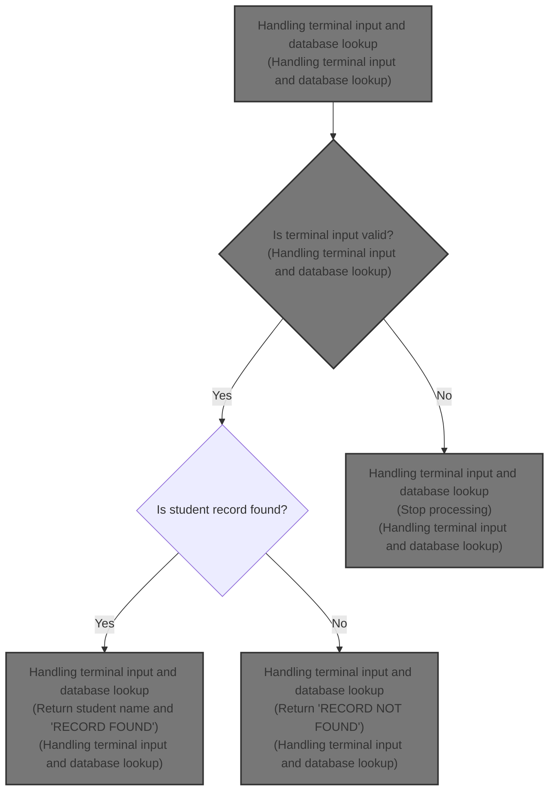

# Overview

This document explains how terminal input is processed to look up student records. Users enter a student ID via the terminal, and the system responds with the student name and a message indicating whether the record was found.

## Dependencies

### Programs

- MSGSAMP1 (<SwmPath>[src/imsdc.cob](src/imsdc.cob)</SwmPath>)
- CBLTDLI

&nbsp;

*This is an auto-generated document by Swimm 🌊 and has not yet been verified by a human*

<SwmMeta version="3.0.0" repo-id="Z2l0aHViJTNBJTNBaW1zZGJkYyUzQSUzQUdpcmktU3dpbW0=" repo-name="imsdbdc">Powered by [Swimm](https://app.swimm.io/)</SwmMeta>
