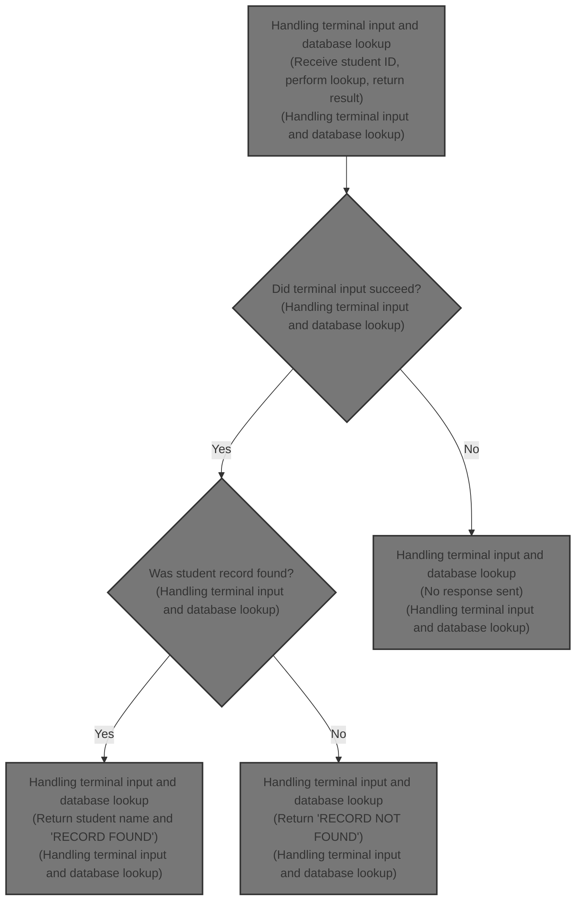
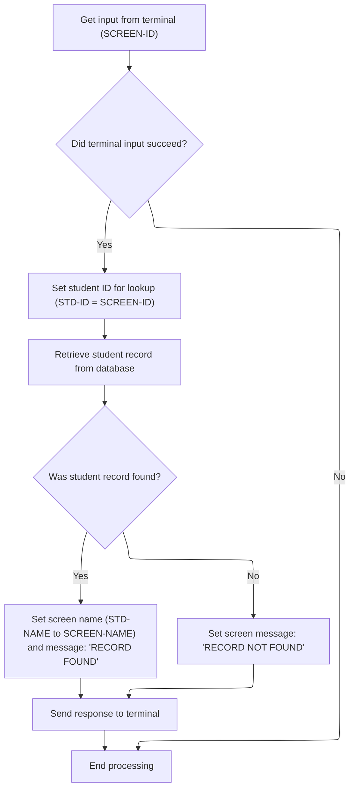

# Overview

This document explains how terminal input is used to look up student records. When a student ID is entered, the system searches the database and returns the student name and a result message to the terminal.



## Dependencies

### Programs

- <SwmToken path="src/imsdc.cob" pos="2:6:6" line-data="       PROGRAM-ID. MSGSAMP1.">`MSGSAMP1`</SwmToken> (<SwmPath>[src/imsdc.cob](src/imsdc.cob)</SwmPath>)
- CBLTDLI

## Input and Output Tables/Files used

### <SwmToken path="src/imsdc.cob" pos="2:6:6" line-data="       PROGRAM-ID. MSGSAMP1.">`MSGSAMP1`</SwmToken> (<SwmPath>[src/imsdc.cob](src/imsdc.cob)</SwmPath>)

| Table / File Name                                                                                                                                               | Type | Description                                               | Usage Mode | Key Fields / Layout Highlights |
| --------------------------------------------------------------------------------------------------------------------------------------------------------------- | ---- | --------------------------------------------------------- | ---------- | ------------------------------ |
| <SwmToken path="src/imsdc.cob" pos="47:19:21" line-data="           CALL &#39;CBLTDLI&#39; USING DLI-GU, DB-PCB, STUDENT-SEGMENT.">`STUDENT-SEGMENT`</SwmToken> | IMS  | Student ID, name, and grade records for academic tracking | Input      | Hierarchical segment structure |

# Workflow

# Handling terminal input and database lookup



This section manages the process of receiving a student ID from the terminal, performing a database lookup for the student record, and returning a result message and student name to the terminal based on the lookup outcome.

| Rule ID | Category        | Rule Name                 | Description                                                                                                                             | Implementation Details                                                                                                                                                               |
| ------- | --------------- | ------------------------- | --------------------------------------------------------------------------------------------------------------------------------------- | ------------------------------------------------------------------------------------------------------------------------------------------------------------------------------------ |
| BR-001  | Reading Input   | Student ID lookup key     | The student ID entered on the terminal is used as the key for the database lookup.                                                      | The student ID from the terminal (string, 4 characters) is used as the lookup key for the student database segment (string, 5 characters).                                           |
| BR-002  | Data validation | Terminal input required   | If terminal input fails, processing stops and no further actions are taken.                                                             | If the terminal input is unsuccessful, the process ends immediately. No output is sent to the terminal in this case.                                                                 |
| BR-003  | Decision Making | Record found response     | If a student record is found in the database, the student name is returned to the terminal and the message 'RECORD FOUND' is displayed. | If the student record is found, the output includes the student name (string, 20 characters) and the message 'RECORD FOUND' (string, 40 characters) in the response to the terminal. |
| BR-004  | Decision Making | Record not found response | If a student record is not found in the database, the message 'RECORD NOT FOUND' is displayed on the terminal.                          | If the student record is not found, the output message is 'RECORD NOT FOUND' (string, 40 characters) in the response to the terminal. The student name field is not updated.         |
| BR-005  | Writing Output  | Send terminal response    | After processing the lookup result, the response is sent back to the terminal with the current values of the name and message fields.   | The response includes the student name (if found, string, 20 characters) and the message ('RECORD FOUND' or 'RECORD NOT FOUND', string, 40 characters).                              |

<SwmSnippet path="/src/imsdc.cob" line="37">

---

In <SwmToken path="src/imsdc.cob" pos="37:1:5" line-data="       A000-MAIN-PROCESSING.">`A000-MAIN-PROCESSING`</SwmToken>, we start by calling the IMS terminal input function to get user data. If the input fails (checked via <SwmToken path="src/imsdc.cob" pos="41:3:7" line-data="           IF IO-PCB-STATUS NOT = SPACES">`IO-PCB-STATUS`</SwmToken>), the flow exits right away without processing anything further.

```cobol
       A000-MAIN-PROCESSING.
      * 1. Get input from Terminal (MFS screen)
           CALL 'CBLTDLI' USING DLI-GU, I-O-PCB, SCREEN-I-O-AREA.
           
           IF IO-PCB-STATUS NOT = SPACES
              GOBACK
           END-IF.
```

---

</SwmSnippet>

<SwmSnippet path="/src/imsdc.cob" line="46">

---

Next, the student ID from the screen is moved to the database segment, and a database call is made to fetch the student record. If found, the student name is moved to the screen and the message is set to 'RECORD FOUND'; otherwise, the message is 'RECORD NOT FOUND'. Finally, the output is sent back to the terminal and the flow exits.

```cobol
           MOVE SCREEN-ID TO STD-ID.
           CALL 'CBLTDLI' USING DLI-GU, DB-PCB, STUDENT-SEGMENT.
           
      * 3. Process and Send response back to Terminal
           IF DB-PCB-STATUS = SPACES
              MOVE STD-NAME TO SCREEN-NAME
              MOVE 'RECORD FOUND' TO SCREEN-MSG
           ELSE
              MOVE 'RECORD NOT FOUND' TO SCREEN-MSG
           END-IF.
           
           CALL 'CBLTDLI' USING DLI-ISRT, I-O-PCB, SCREEN-I-O-AREA.
           
           GOBACK.
```

---

</SwmSnippet>

&nbsp;

*This is an auto-generated document by Swimm 🌊 and has not yet been verified by a human*

<SwmMeta version="3.0.0" repo-id="Z2l0aHViJTNBJTNBaW1zZGJkYyUzQSUzQUdpcmktU3dpbW0=" repo-name="imsdbdc"><sup>Powered by [Swimm](https://app.swimm.io/)</sup></SwmMeta>
