# Overview

This document explains the flow for updating parts and their segments. Within the parts management subsystem, the update process ensures the root part is updated first, followed by segment updates and quantity adjustments based on business rules. The changes are made visible to the user by displaying the updated records.

## Dependencies

### Programs

- <SwmToken path="src/part0011.cob" pos="2:7:7" line-data="000200 PROGRAM-ID. PART0011.                                            00020053">`PART0011`</SwmToken> (<SwmPath>[src/part0011.cob](src/part0011.cob)</SwmPath>)
- CBLTDLI
- ABENDPMG

### Copybooks

- <SwmToken path="src/part0011.cob" pos="118:4:4" line-data="010200     INITIALIZE PARTSG01-IO.                                      00461055">`PARTSG01`</SwmToken> (<SwmPath>[src/partsg01.cpy](src/partsg01.cpy)</SwmPath>)
- <SwmToken path="src/part0011.cob" pos="20:4:4" line-data="001300 COPY PRICSG05.                                                   00082010">`PRICSG05`</SwmToken> (<SwmPath>[src/pricsg05.cpy](src/pricsg05.cpy)</SwmPath>)
- <SwmToken path="src/part0011.cob" pos="21:4:4" line-data="001400 COPY ADDLSG07.                                                   00083010">`ADDLSG07`</SwmToken> (<SwmPath>[src/addlsg07.cpy](src/addlsg07.cpy)</SwmPath>)
- <SwmToken path="src/part0011.cob" pos="22:4:4" line-data="001500 COPY STCKSG10.                                                   00084010">`STCKSG10`</SwmToken> (<SwmPath>[src/stcksg10.cpy](src/stcksg10.cpy)</SwmPath>)
- <SwmToken path="src/part0011.cob" pos="193:4:4" line-data="015027     INITIALIZE ORDSEG15-IO.                                      00340160">`ORDSEG15`</SwmToken> (<SwmPath>[src/ordseg15.cpy](src/ordseg15.cpy)</SwmPath>)

# Workflow

# Starting the update process

This section initiates the update process for parts, ensuring the root part is updated first, followed by segment and child parts.

| Rule ID | Category        | Rule Name                     | Description                                                                                                                             | Implementation Details                                                                                                                                                                                                                                              |
| ------- | --------------- | ----------------------------- | --------------------------------------------------------------------------------------------------------------------------------------- | ------------------------------------------------------------------------------------------------------------------------------------------------------------------------------------------------------------------------------------------------------------------- |
| BR-001  | Decision Making | Root part update prerequisite | The root part update is performed before any segment or child updates, establishing the base for subsequent updates.                    | The root part update is handled before segment and child updates. No segment or child updates occur unless the root update is performed first.                                                                                                                      |
| BR-002  | Decision Making | Segment part update sequence  | Segment part updates are performed after the root part update, following the established sequence.                                      | Segment updates follow the root update. The sequence is enforced by the order of PERFORM statements.                                                                                                                                                                |
| BR-003  | Decision Making | Optional child part update    | Child part updates are optional and may be performed after segment updates, depending on whether the child update paragraph is invoked. | Child updates are not always performed; the PERFORM statement is commented out, indicating optional execution.                                                                                                                                                      |
| BR-004  | Writing Output  | Start message display         | A start message is displayed at the beginning of the update process to inform users that the process has started.                       | The message displayed is '<SwmToken path="src/part0011.cob" pos="100:5:5" line-data="008600     DISPLAY &#39;PART0009 STARTED&#39;.                                  00270047">`PART0009`</SwmToken> STARTED'. The format is a string output to the user interface. |

<SwmSnippet path="/src/part0011.cob" line="99">

---

<SwmToken path="src/part0011.cob" pos="99:2:6" line-data="008500 000-MAIN-PARA.                                                   00260000">`000-MAIN-PARA`</SwmToken> kicks off the update sequence. It displays a start message, then calls <SwmToken path="src/part0011.cob" pos="101:4:10" line-data="008700     PERFORM 100-REPL-ROOT-PARA  THRU 100-EXIT.                   00302060">`100-REPL-ROOT-PARA`</SwmToken> to handle the root part update. This is necessary because the root part acts as the base for subsequent updates; without it, segment and child updates don't make sense. After that, it moves on to segment updates and (optionally) child updates, then exits.

```cobol
008500 000-MAIN-PARA.                                                   00260000
008600     DISPLAY 'PART0009 STARTED'.                                  00270047
008700     PERFORM 100-REPL-ROOT-PARA  THRU 100-EXIT.                   00302060
008701     PERFORM 200-REPL-SEGM-PARA  THRU 200-EXIT.                   00303068
008702*    PERFORM 300-REPL-CHILD-PARA THRU 300-EXIT.                   00304068
008800     GOBACK.                                                      00320000
```

---

</SwmSnippet>

# Updating the root part

```mermaid
%%{init: {"flowchart": {"defaultRenderer": "elk"}} }%%
flowchart TD
    node1["Start: Set root found to 'N'"]
    click node1 openCode "src/part0011.cob:107:107"
    node1 --> node2["Display 'BEFORE UPDATE'"]
    click node2 openCode "src/part0011.cob:108:108"
    node2 --> node3["Retrieve root part record"]
    click node3 openCode "src/part0011.cob:109:109"
    node3 --> node4{"Root part found? (WS-ROOT-FOUND = 'Y')"}
    click node4 openCode "src/part0011.cob:110:110"
    node4 -->|"Yes"| node5["Update root part record"]
    click node5 openCode "src/part0011.cob:111:111"
    node4 -->|"No"| node6["Display 'AFTER UPDATE'"]
    click node6 openCode "src/part0011.cob:113:113"
    node5 --> node6
    node6 --> node7["Re-check root part record"]
    click node7 openCode "src/part0011.cob:114:114"

classDef HeadingStyle fill:#777777,stroke:#333,stroke-width:2px;

%% Swimm:
%% %%{init: {"flowchart": {"defaultRenderer": "elk"}} }%%
%% flowchart TD
%%     node1["Start: Set root found to 'N'"]
%%     click node1 openCode "<SwmPath>[src/part0011.cob](src/part0011.cob)</SwmPath>:107:107"
%%     node1 --> node2["Display 'BEFORE UPDATE'"]
%%     click node2 openCode "<SwmPath>[src/part0011.cob](src/part0011.cob)</SwmPath>:108:108"
%%     node2 --> node3["Retrieve root part record"]
%%     click node3 openCode "<SwmPath>[src/part0011.cob](src/part0011.cob)</SwmPath>:109:109"
%%     node3 --> node4{"Root part found? (<SwmToken path="src/part0011.cob" pos="107:10:14" line-data="009100     MOVE &#39;N&#39;   TO  WS-ROOT-FOUND.                                00350053">`WS-ROOT-FOUND`</SwmToken> = 'Y')"}
%%     click node4 openCode "<SwmPath>[src/part0011.cob](src/part0011.cob)</SwmPath>:110:110"
%%     node4 -->|"Yes"| node5["Update root part record"]
%%     click node5 openCode "<SwmPath>[src/part0011.cob](src/part0011.cob)</SwmPath>:111:111"
%%     node4 -->|"No"| node6["Display 'AFTER UPDATE'"]
%%     click node6 openCode "<SwmPath>[src/part0011.cob](src/part0011.cob)</SwmPath>:113:113"
%%     node5 --> node6
%%     node6 --> node7["Re-check root part record"]
%%     click node7 openCode "<SwmPath>[src/part0011.cob](src/part0011.cob)</SwmPath>:114:114"
%% 
%% classDef HeadingStyle fill:#777777,stroke:#333,stroke-width:2px;
```



This section governs the process for updating the root part record, including validation of its existence, performing the update, and confirming the change.

| Rule ID | Category        | Rule Name                          | Description                                                                                                                                                      | Implementation Details                                                                                                                                                                                                                                                                           |
| ------- | --------------- | ---------------------------------- | ---------------------------------------------------------------------------------------------------------------------------------------------------------------- | ------------------------------------------------------------------------------------------------------------------------------------------------------------------------------------------------------------------------------------------------------------------------------------------------ |
| BR-001  | Data validation | Root part retrieval error handling | If the retrieval of the root part record returns an error status code other than 'GE' or success, an error message is displayed and the abort routine is called. | Error messages include the status code and the key used (<SwmToken path="src/part0011.cob" pos="119:5:5" line-data="010300     MOVE &#39;PN00B&#39;  TO  FIELD-VALUE-01                             00470053">`PN00B`</SwmToken>). The abort routine is invoked to handle the error.             |
| BR-002  | Decision Making | Conditional root part update       | The root part record is only updated if it is found during the retrieval process.                                                                                | The root part is identified by the key <SwmToken path="src/part0011.cob" pos="119:5:5" line-data="010300     MOVE &#39;PN00B&#39;  TO  FIELD-VALUE-01                             00470053">`PN00B`</SwmToken>. The update is only performed if the retrieval sets the root found flag to 'Y'.   |
| BR-003  | Decision Making | No update when root part missing   | If the root part record is not found, no update is performed and the post-update state is displayed.                                                             | The root part is identified by the key <SwmToken path="src/part0011.cob" pos="119:5:5" line-data="010300     MOVE &#39;PN00B&#39;  TO  FIELD-VALUE-01                             00470053">`PN00B`</SwmToken>. If not found, the root found flag is set to 'N' and no update logic is executed. |
| BR-004  | Writing Output  | Display root part state            | The state of the root part record is displayed before and after the update attempt, regardless of whether an update occurs.                                      | Display messages include 'BEFORE UPDATE' and 'AFTER UPDATE'. The root part data is shown if found.                                                                                                                                                                                               |

<SwmSnippet path="/src/part0011.cob" line="106">

---

In <SwmToken path="src/part0011.cob" pos="106:2:8" line-data="009000 100-REPL-ROOT-PARA.                                              00346060">`100-REPL-ROOT-PARA`</SwmToken>, we prep for the root part update by setting <SwmToken path="src/part0011.cob" pos="107:10:14" line-data="009100     MOVE &#39;N&#39;   TO  WS-ROOT-FOUND.                                00350053">`WS-ROOT-FOUND`</SwmToken> to 'N', displaying the pre-update state, and then calling <SwmToken path="src/part0011.cob" pos="109:4:10" line-data="009300     PERFORM 110-GU-ROOT-PARA  THRU 110-EXIT                      00360053">`110-GU-ROOT-PARA`</SwmToken> to fetch the root record. We need to call <SwmToken path="src/part0011.cob" pos="109:4:10" line-data="009300     PERFORM 110-GU-ROOT-PARA  THRU 110-EXIT                      00360053">`110-GU-ROOT-PARA`</SwmToken> because the update only makes sense if the root part exists.

```cobol
009000 100-REPL-ROOT-PARA.                                              00346060
009100     MOVE 'N'   TO  WS-ROOT-FOUND.                                00350053
009200     DISPLAY 'BEFORE UPDATE '                                     00351057
009300     PERFORM 110-GU-ROOT-PARA  THRU 110-EXIT                      00360053
```

---

</SwmSnippet>

<SwmSnippet path="/src/part0011.cob" line="117">

---

<SwmToken path="src/part0011.cob" pos="117:2:8" line-data="010100 110-GU-ROOT-PARA.                                                00460053">`110-GU-ROOT-PARA`</SwmToken> fetches the root part using <SwmToken path="src/part0011.cob" pos="119:5:5" line-data="010300     MOVE &#39;PN00B&#39;  TO  FIELD-VALUE-01                             00470053">`PN00B`</SwmToken> as the key, calling the external routine 'CBLTDLI' with domain-specific parameters. It checks <SwmToken path="src/part0011.cob" pos="124:4:6" line-data="010800     IF STATUS-CODE = &#39;  &#39;                                        00520053">`STATUS-CODE`</SwmToken> to decide if the record was found, not found, or if there's an error, and either sets a flag, displays messages, or calls the abort program.

```cobol
010100 110-GU-ROOT-PARA.                                                00460053
010200     INITIALIZE PARTSG01-IO.                                      00461055
010300     MOVE 'PN00B'  TO  FIELD-VALUE-01                             00470053
010400     CALL 'CBLTDLI'  USING DLI-GU,                                00480058
010500                           PCB-MASK-1,                            00490053
010600                           PARTSG01-IO,                           00500053
010700                           PARTSG01-QUAL-SSA.                     00510053
010800     IF STATUS-CODE = '  '                                        00520053
010900        MOVE  'Y'    TO  WS-ROOT-FOUND                            00530053
011000        DISPLAY 'PART ROOT DATA IS ' PARTSG01-IO                  00530153
011100     ELSE                                                         00531053
011200     IF STATUS-CODE = 'GE'                                        00532053
011300        MOVE 'N'     TO WS-ROOT-FOUND                             00550053
011400     ELSE                                                         00551053
011500        DISPLAY 'ERROR IN GU ROOT STATUS ' STATUS-CODE            00552058
011600        DISPLAY 'KEY IS  PART NUMBER ' FIELD-VALUE-01             00553053
011700        CALL WS-ABENDPGM                                          00554053
011800     END-IF                                                       00555053
011900     END-IF.                                                      00560053
```

---

</SwmSnippet>

<SwmSnippet path="/src/part0011.cob" line="110">

---

Back in <SwmToken path="src/part0011.cob" pos="101:4:10" line-data="008700     PERFORM 100-REPL-ROOT-PARA  THRU 100-EXIT.                   00302060">`100-REPL-ROOT-PARA`</SwmToken>, after returning from <SwmToken path="src/part0011.cob" pos="114:4:10" line-data="009800     PERFORM 110-GU-ROOT-PARA  THRU 110-EXIT.                     00430053">`110-GU-ROOT-PARA`</SwmToken>, we check if <SwmToken path="src/part0011.cob" pos="110:4:8" line-data="009400     IF WS-ROOT-FOUND = &#39;Y&#39;                                       00370053">`WS-ROOT-FOUND`</SwmToken> is 'Y'. If so, we perform the update logic, then display the post-update state by fetching the root part again. This makes the update visible and confirms the change.

```cobol
009400     IF WS-ROOT-FOUND = 'Y'                                       00370053
009500         PERFORM 120-HOLD-REPL-PARA THRU 120-EXIT                 00380057
009600     END-IF.                                                      00410055
009700     DISPLAY 'AFTER UPDATE '                                      00420053
009800     PERFORM 110-GU-ROOT-PARA  THRU 110-EXIT.                     00430053
```

---

</SwmSnippet>

# Updating segment quantities

This section displays the pre-update state of order segments by fetching them from the IMS database, showing their data, and handling end-of-data and error conditions.

| Rule ID | Category        | Rule Name                        | Description                                                                                                                           | Implementation Details                                                                                                                         |
| ------- | --------------- | -------------------------------- | ------------------------------------------------------------------------------------------------------------------------------------- | ---------------------------------------------------------------------------------------------------------------------------------------------- |
| BR-001  | Data validation | Segment retrieval error handling | Display an error message and invoke an error routine when segment retrieval fails with a status code other than blank, 'GE', or 'GB'. | Error messages are displayed as strings, including the status code. The error routine is invoked to handle the failure.                        |
| BR-002  | Decision Making | End-of-segment detection         | Indicate the end of the segment record set when IMS database retrieval returns a status code of 'GE' or 'GB'.                         | The end-of-record message is displayed as a string, including the status code. The value 'Y' is used to mark the end-of-segment condition.     |
| BR-003  | Writing Output  | Pre-update segment display       | Display the segment data for each order segment fetched from the IMS database before any updates are performed.                       | Segment data is displayed as a string. No specific format or padding is enforced in the code; the output is the raw segment data as retrieved. |

<SwmSnippet path="/src/part0011.cob" line="175">

---

In <SwmToken path="src/part0011.cob" pos="175:2:8" line-data="015009 200-REPL-SEGM-PARA.                                              00338360">`200-REPL-SEGM-PARA`</SwmToken>, we display the pre-update state, set <SwmToken path="src/part0011.cob" pos="177:10:16" line-data="015011     MOVE &#39;N&#39;   TO WS-END-OF-SEG.                                 00338560">`WS-END-OF-SEG`</SwmToken> to 'N', and loop through <SwmToken path="src/part0011.cob" pos="178:4:10" line-data="015012     PERFORM 210-GN-SEG-PARA  THRU 210-EXIT                       00338662">`210-GN-SEG-PARA`</SwmToken> until all segments are fetched. This loop is controlled by <SwmToken path="src/part0011.cob" pos="177:10:16" line-data="015011     MOVE &#39;N&#39;   TO WS-END-OF-SEG.                                 00338560">`WS-END-OF-SEG`</SwmToken>, which is set by the paragraphs being called. Fetching segments before the update lets us show the initial state.

```cobol
015009 200-REPL-SEGM-PARA.                                              00338360
015010     DISPLAY 'BEFORE UPDATE '                                     00338460
015011     MOVE 'N'   TO WS-END-OF-SEG.                                 00338560
015012     PERFORM 210-GN-SEG-PARA  THRU 210-EXIT                       00338662
015013           UNTIL  WS-END-OF-SEG = 'Y'.                            00338760
```

---

</SwmSnippet>

<SwmSnippet path="/src/part0011.cob" line="192">

---

<SwmToken path="src/part0011.cob" pos="192:2:8" line-data="015026 210-GN-SEG-PARA.                                                 00340064">`210-GN-SEG-PARA`</SwmToken> initializes the segment IO structure, calls 'CBLTDLI' to fetch segment data, and checks <SwmToken path="src/part0011.cob" pos="198:4:6" line-data="015032     IF STATUS-CODE = &#39; &#39;                                         00340660">`STATUS-CODE`</SwmToken>. If it's 'GE' or 'GB', that's the end of the record set and <SwmToken path="src/part0011.cob" pos="203:10:16" line-data="015037        MOVE &#39;Y&#39;   TO WS-END-OF-SEG                               00341160">`WS-END-OF-SEG`</SwmToken> is set to 'Y'. Errors trigger an abort. Segment data is displayed if found.

```cobol
015026 210-GN-SEG-PARA.                                                 00340064
015027     INITIALIZE ORDSEG15-IO.                                      00340160
015028     CALL 'CBLTDLI'  USING  DLI-GN,                               00340260
015029                            PCB-MASK-1,                           00340360
015030                            ORDSEG15-IO,                          00340461
015031                            UNQUAL-SSA-15.                        00340560
015032     IF STATUS-CODE = ' '                                         00340660
015033        DISPLAY ' ORDER DATA IS ' ORDSEG15-IO                     00340760
015034     ELSE                                                         00340860
015035     IF STATUS-CODE = 'GE' OR 'GB'                                00340960
015036        DISPLAY 'END OF RECORD ' STATUS-CODE                      00341060
015037        MOVE 'Y'   TO WS-END-OF-SEG                               00341160
015038     ELSE                                                         00341260
015039        DISPLAY 'ERROR IN 200-GN PARA'                            00341360
015040        DISPLAY 'STATUS CODE IS  ' STATUS-CODE                    00341460
015041        CALL WS-ABENDPGM                                          00341560
015042     END-IF.                                                      00341660
```

---

</SwmSnippet>

<SwmSnippet path="/src/part0011.cob" line="181">

---

After fetching segments, <SwmToken path="src/part0011.cob" pos="102:4:10" line-data="008701     PERFORM 200-REPL-SEGM-PARA  THRU 200-EXIT.                   00303068">`200-REPL-SEGM-PARA`</SwmToken> loops through <SwmToken path="src/part0011.cob" pos="182:4:12" line-data="015016     PERFORM 220-HOLD-REPL-SEG-PARA THRU 220-EXIT                 00339066">`220-HOLD-REPL-SEG-PARA`</SwmToken> to update each segment.

```cobol
015015     MOVE 'N'   TO WS-END-OF-SEG.                                 00338965
015016     PERFORM 220-HOLD-REPL-SEG-PARA THRU 220-EXIT                 00339066
015017           UNTIL  WS-END-OF-SEG = 'Y'.                            00339160
```

---

</SwmSnippet>

## Adjusting segment quantities

```mermaid
%%{init: {"flowchart": {"defaultRenderer": "elk"}} }%%
flowchart TD
    node1["Initialize order segment and call database to retrieve segment"] --> node2{"Was retrieval successful? (STATUS-CODE = SPACE)"}
    click node1 openCode "src/part0011.cob:211:216"
    node2 -->|"Yes"| node3{"Is order quantity > 16?"}
    click node2 openCode "src/part0011.cob:217:217"
    node3 -->|"Yes"| node4["Subtract 5 from order quantity"]
    click node3 openCode "src/part0011.cob:218:219"
    node3 -->|"No"| node5["Add 5 to order quantity"]
    click node5 openCode "src/part0011.cob:221:221"
    node4 --> node6["Perform replacement logic"]
    click node4 openCode "src/part0011.cob:223:223"
    node5 --> node6
    node6 --> node13["Order quantity adjusted and replacement performed"]
    click node6 openCode "src/part0011.cob:223:223"
    node2 -->|"No"| node8{"End of segment? (STATUS-CODE = 'GE' or 'GB')"}
    click node8 openCode "src/part0011.cob:225:225"
    node8 -->|"Yes"| node9["Display end of segment, set end marker"]
    click node9 openCode "src/part0011.cob:226:227"
    node8 -->|"No"| node10["Display error and trigger abnormal end"]
    click node10 openCode "src/part0011.cob:229:231"

classDef HeadingStyle fill:#777777,stroke:#333,stroke-width:2px;

%% Swimm:
%% %%{init: {"flowchart": {"defaultRenderer": "elk"}} }%%
%% flowchart TD
%%     node1["Initialize order segment and call database to retrieve segment"] --> node2{"Was retrieval successful? (<SwmToken path="src/part0011.cob" pos="124:4:6" line-data="010800     IF STATUS-CODE = &#39;  &#39;                                        00520053">`STATUS-CODE`</SwmToken> = SPACE)"}
%%     click node1 openCode "<SwmPath>[src/part0011.cob](src/part0011.cob)</SwmPath>:211:216"
%%     node2 -->|"Yes"| node3{"Is order quantity > 16?"}
%%     click node2 openCode "<SwmPath>[src/part0011.cob](src/part0011.cob)</SwmPath>:217:217"
%%     node3 -->|"Yes"| node4["Subtract 5 from order quantity"]
%%     click node3 openCode "<SwmPath>[src/part0011.cob](src/part0011.cob)</SwmPath>:218:219"
%%     node3 -->|"No"| node5["Add 5 to order quantity"]
%%     click node5 openCode "<SwmPath>[src/part0011.cob](src/part0011.cob)</SwmPath>:221:221"
%%     node4 --> node6["Perform replacement logic"]
%%     click node4 openCode "<SwmPath>[src/part0011.cob](src/part0011.cob)</SwmPath>:223:223"
%%     node5 --> node6
%%     node6 --> node13["Order quantity adjusted and replacement performed"]
%%     click node6 openCode "<SwmPath>[src/part0011.cob](src/part0011.cob)</SwmPath>:223:223"
%%     node2 -->|"No"| node8{"End of segment? (<SwmToken path="src/part0011.cob" pos="124:4:6" line-data="010800     IF STATUS-CODE = &#39;  &#39;                                        00520053">`STATUS-CODE`</SwmToken> = 'GE' or 'GB')"}
%%     click node8 openCode "<SwmPath>[src/part0011.cob](src/part0011.cob)</SwmPath>:225:225"
%%     node8 -->|"Yes"| node9["Display end of segment, set end marker"]
%%     click node9 openCode "<SwmPath>[src/part0011.cob](src/part0011.cob)</SwmPath>:226:227"
%%     node8 -->|"No"| node10["Display error and trigger abnormal end"]
%%     click node10 openCode "<SwmPath>[src/part0011.cob](src/part0011.cob)</SwmPath>:229:231"
%% 
%% classDef HeadingStyle fill:#777777,stroke:#333,stroke-width:2px;
```



This section manages the retrieval and adjustment of order segment quantities, handling both normal and exceptional outcomes based on database status codes.

| Rule ID | Category        | Rule Name                       | Description                                                                                                                                            | Implementation Details                                                                                                                                                                                                       |
| ------- | --------------- | ------------------------------- | ------------------------------------------------------------------------------------------------------------------------------------------------------ | ---------------------------------------------------------------------------------------------------------------------------------------------------------------------------------------------------------------------------- |
| BR-001  | Data validation | Error handling and notification | When an error occurs during segment retrieval or update, display error messages and trigger abnormal termination of the process.                       | Error messages are displayed to the user, including the current status code. The process is terminated by calling the abort program.                                                                                         |
| BR-002  | Calculation     | Order quantity adjustment       | When an order segment is successfully retrieved, adjust the order quantity by subtracting 5 if the quantity is greater than 16, or adding 5 otherwise. | The adjustment value is 5. The threshold for subtraction is 16. The order quantity is a 2-digit number field. The adjustment is always exactly 5, either added or subtracted, depending on whether the quantity is above 16. |
| BR-003  | Decision Making | End-of-segment handling         | When the retrieval status indicates end-of-segment, display an end-of-segment message and set the end marker for further processing.                   | The end-of-segment status codes are 'GE' and 'GB'. The end marker is set to 'Y'. The message displayed includes the status code.                                                                                             |

<SwmSnippet path="/src/part0011.cob" line="211">

---

In <SwmToken path="src/part0011.cob" pos="211:2:10" line-data="015045 220-HOLD-REPL-SEG-PARA.                                          00341963">`220-HOLD-REPL-SEG-PARA`</SwmToken>, we call 'CBLTDLI' to fetch a segment. If successful, we adjust <SwmToken path="src/part0011.cob" pos="218:4:6" line-data="015052        IF ORDER-QTY &gt; 16                                         00342667">`ORDER-QTY`</SwmToken> based on a rule (subtract 5 if >16, add 5 otherwise), then call <SwmToken path="src/part0011.cob" pos="223:4:8" line-data="015057        PERFORM 225-REPL-PARA THRU 225-EXIT                       00343160">`225-REPL-PARA`</SwmToken> to update. End-of-data or errors are handled by checking <SwmToken path="src/part0011.cob" pos="124:4:6" line-data="010800     IF STATUS-CODE = &#39;  &#39;                                        00520053">`STATUS-CODE`</SwmToken>.

```cobol
015045 220-HOLD-REPL-SEG-PARA.                                          00341963
015046     INITIALIZE ORDSEG15-IO                                       00342064
015047     CALL 'CBLTDLI'  USING DLI-GHN,                               00342160
015048                           PCB-MASK-1,                            00342260
015049                           ORDSEG15-IO,                           00342361
015050                           UNQUAL-SSA-15.                         00342460
```

---

</SwmSnippet>

<SwmSnippet path="/src/part0011.cob" line="217">

---

After fetching a segment and checking <SwmToken path="src/part0011.cob" pos="217:4:6" line-data="015051     IF STATUS-CODE = SPACE                                       00342560">`STATUS-CODE`</SwmToken>, we adjust <SwmToken path="src/part0011.cob" pos="218:4:6" line-data="015052        IF ORDER-QTY &gt; 16                                         00342667">`ORDER-QTY`</SwmToken> by 5 depending on its value, then call <SwmToken path="src/part0011.cob" pos="223:4:8" line-data="015057        PERFORM 225-REPL-PARA THRU 225-EXIT                       00343160">`225-REPL-PARA`</SwmToken> to update the segment. This ties the adjustment logic directly to the business rule.

```cobol
015051     IF STATUS-CODE = SPACE                                       00342560
015052        IF ORDER-QTY > 16                                         00342667
015053           SUBTRACT 5 FROM ORDER-QTY                              00342760
015054        ELSE                                                      00342860
015055           ADD  5 TO ORDER-QTY                                    00342960
015056        END-IF                                                    00343060
015057        PERFORM 225-REPL-PARA THRU 225-EXIT                       00343160
```

---

</SwmSnippet>

<SwmSnippet path="/src/part0011.cob" line="224">

---

If <SwmToken path="src/part0011.cob" pos="225:4:6" line-data="015059     IF STATUS-CODE = &#39;GE&#39; OR &#39;GB&#39;                                00343360">`STATUS-CODE`</SwmToken> is 'GE' or 'GB', we display an end-of-data message and set <SwmToken path="src/part0011.cob" pos="227:10:16" line-data="015061        MOVE &#39;Y&#39;   TO WS-END-OF-SEG                               00343560">`WS-END-OF-SEG`</SwmToken> to 'Y', ending the update loop for segments.

```cobol
015058     ELSE                                                         00343260
015059     IF STATUS-CODE = 'GE' OR 'GB'                                00343360
015060        DISPLAY 'END OF GHU '  STATUS-CODE                        00343460
015061        MOVE 'Y'   TO WS-END-OF-SEG                               00343560
```

---

</SwmSnippet>

<SwmSnippet path="/src/part0011.cob" line="228">

---

If there's an error during segment update, we display error messages and call the abort program, so the flow stops and the user sees what went wrong.

```cobol
015062     ELSE                                                         00343660
015063        DISPLAY 'ERROR IN 220-GHN PARA'                           00343760
015064        DISPLAY 'STATUS CODE IS  ' STATUS-CODE                    00343860
015065        CALL WS-ABENDPGM                                          00343960
015066     END-IF                                                       00344060
015067     END-IF.                                                      00344160
```

---

</SwmSnippet>

## Displaying updated segments

<SwmSnippet path="/src/part0011.cob" line="185">

---

After returning from <SwmToken path="src/part0011.cob" pos="182:4:12" line-data="015016     PERFORM 220-HOLD-REPL-SEG-PARA THRU 220-EXIT                 00339066">`220-HOLD-REPL-SEG-PARA`</SwmToken>, <SwmToken path="src/part0011.cob" pos="102:4:10" line-data="008701     PERFORM 200-REPL-SEGM-PARA  THRU 200-EXIT.                   00303068">`200-REPL-SEGM-PARA`</SwmToken> displays the updated segments by looping through <SwmToken path="src/part0011.cob" pos="187:4:10" line-data="015021     PERFORM 210-GN-SEG-PARA  THRU 210-EXIT                       00339560">`210-GN-SEG-PARA`</SwmToken> again. <SwmToken path="src/part0011.cob" pos="186:10:16" line-data="015020     MOVE &#39;N&#39;   TO WS-END-OF-SEG.                                 00339460">`WS-END-OF-SEG`</SwmToken> controls the loop, and this step makes the updates visible.

```cobol
015019     DISPLAY 'AFTER  UPDATE '                                     00339360
015020     MOVE 'N'   TO WS-END-OF-SEG.                                 00339460
015021     PERFORM 210-GN-SEG-PARA  THRU 210-EXIT                       00339560
015022           UNTIL  WS-END-OF-SEG = 'Y'.                            00339660
```

---

</SwmSnippet>

&nbsp;

*This is an auto-generated document by Swimm 🌊 and has not yet been verified by a human*

<SwmMeta version="3.0.0" repo-id="Z2l0aHViJTNBJTNBaW1zZGJkYyUzQSUzQUdpcmktU3dpbW0=" repo-name="imsdbdc"><sup>Powered by [Swimm](https://app.swimm.io/)</sup></SwmMeta>
